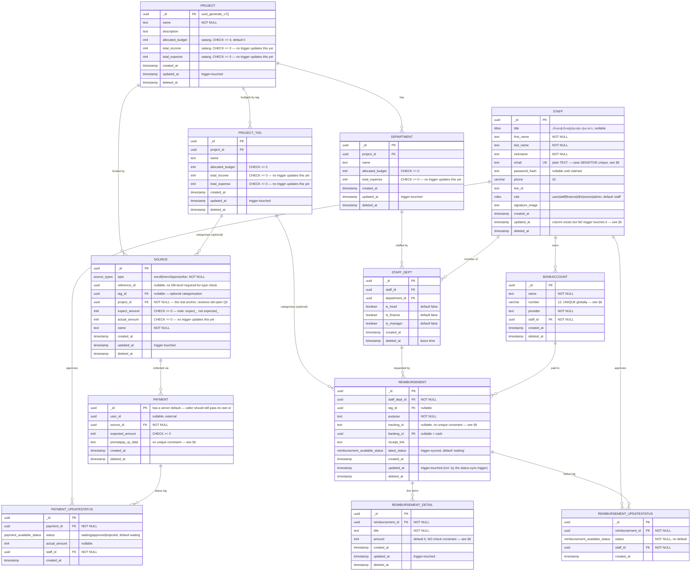

# 02 — Database Design

[← Index](README.md)

PostgreSQL 15 (Supabase). **This document now describes the schema as actually shipped** in
`supabase/migrations/20260101000000_init.sql` (ขัตมอส, committed 2026-07-22) — not the speculative
9-file design this document held before. Sequelize maps this file; it never defines it.

> **Status: the shipped schema has real gaps against what the team agreed on.** Section 6 below
> lists them. Per team decision (2026-07-22), this document only *describes* those gaps — no new
> migration is written here. ขัตมอส owns the SQL; this doc is the reference for whoever picks up
> each gap next.

## Ground rules (as shipped)

- **Primary keys** — UUIDv7 everywhere, column `_id` on every table (including
  `reimbursement_detail`, `payment_updatestatus`, `reimbursement_updatestatus` — no table uses a
  bare `id`). Default `uuid_generate_v7()`, a hand-written function (Supabase has no built-in v7)
  wrapping `gen_random_uuid()` + a millisecond timestamp overlay.
- **Table names are singular**: `project`, `department`, `staff`, `source`, `payment`,
  `reimbursement`, `reimbursement_detail` — except `project_tag`, `staff_dept`, `bankaccount`
  (one word, no underscore), `payment_updatestatus`, `reimbursement_updatestatus`, which keep
  their compound names.
- **Soft deletes** — `deleted_at` on every table that can be end-user-deleted. The three
  append-only log/junction-adjacent tables that are never deleted in place
  (`payment_updatestatus`, `reimbursement_updatestatus`) skip it, correctly — nothing there is
  ever removed, so a `deleted_at` column would never be set.
- **Timestamps are inconsistent with the 2026-07-20 decision.** ขัตมอส/ชมพู่ agreed every table
  gets `updated_at`; what shipped is narrower. See §6.
- **Money is `INTEGER` (int4), unit satang** — matches the 2026-07-20 decision exactly. Most
  amount columns also carry `CHECK (... >= 0)`, a nice addition not in the original plan.
  `reimbursement_detail.amount` is the one exception with no check — see §6.
- **Aggregates are *supposed* to be trigger-maintained, but the triggers don't exist yet.**
  `source.actual_amount`, `project_tag.total_income`/`total_expense`,
  `project.total_income`/`total_expense`, `department.total_expense` are all real columns with no
  code path that ever updates them. This is the most consequential gap — see §6.

## ER diagram

Reflects the actual column set, types, and nullability in the shipped migration.



**No `total_amount` cache on `reimbursement`.** The 2026-07-20 decision asked for both the latest
status *and* the running total to be cached on the parent row ("สถานะล่าสุด**/ยอดเงินรวม**ใน
REIMBURSEMENT"). Only `latest_status` shipped. `total_amount` must currently be computed as
`SELECT SUM(amount) FROM reimbursement_detail WHERE reimbursement_id = ... AND deleted_at IS NULL`
at read time until a follow-up migration adds the column + trigger.

## Enums (as shipped)

```sql
CREATE TYPE titles AS ENUM ('เด็กชาย', 'เด็กหญิง', 'นาย', 'นาง', 'นางสาว');

CREATE TYPE roles AS ENUM ('user', 'staff', 'finance', 'it', 'hr', 'owner', 'admin');

CREATE TYPE source_types AS ENUM ('enroll', 'merch', 'spon', 'other');

CREATE TYPE payment_available_status AS ENUM ('waiting', 'approved', 'rejected');

CREATE TYPE reimbursement_available_status AS ENUM (
  'waiting',       -- created; awaiting head approval. There is NO separate draft state.
  'rejected',
  'delete',        -- functionally CANCELLED
  'head_approve',  -- head has approved; awaiting finance
  'fin_approve',   -- finance has approved; awaiting transfer
  'transfer'       -- owner has paid — terminal, expense is recognised here
);
```

Differences from the design this doc used to propose:

- `titles` includes เด็กชาย/เด็กหญิง (minor titles) — staff pool includes underage
  volunteers/students, which the Development Plan didn't call out.
- `roles` includes `'user'` ahead of `'staff'`. Not mentioned anywhere in the Development Plan.
  Best guess: carried over from Enroll's convention where participants default to `role: "user"`.
  Worth a one-line confirm with ขัตมอส on whether it means anything in this system or is an
  unused leftover — low priority, doesn't block anything.
- `reimbursement_available_status` has **6 states, not 7**, and no draft stage. See §4 for the
  corrected state machine — this replaces the `DRAFT/PENDING_HEAD/PENDING_FINANCE/APPROVED/
  TRANSFERRED/REJECTED/CANCELLED` design in the old version of this document and in
  [doc 04](04-authorization.md), which is now being rewritten to match.

## Indexes (as shipped)

```sql
CREATE INDEX ON department (project_id) WHERE deleted_at IS NULL;
CREATE INDEX ON source (project_id) WHERE deleted_at IS NULL;
CREATE INDEX ON source (tag_id) WHERE deleted_at IS NULL;
CREATE INDEX ON staff_dept (staff_id) WHERE deleted_at IS NULL;
CREATE INDEX ON staff_dept (department_id) WHERE deleted_at IS NULL;
CREATE INDEX ON payment (source_id) WHERE deleted_at IS NULL;
CREATE INDEX ON payment_updatestatus (payment_id, created_at DESC);
-- CREATE INDEX ON payment_updatestatus (status) WHERE created_at > now() - interval '30 days';  -- commented out in the migration
CREATE INDEX ON reimbursement_updatestatus (reimbursement_id, created_at DESC);
CREATE INDEX ON reimbursement (staff_dept_id) WHERE deleted_at IS NULL;
CREATE INDEX ON reimbursement_detail (reimbursement_id) WHERE deleted_at IS NULL;
CREATE UNIQUE INDEX ON bankaccount (number, provider);
```

No index on `reimbursement (tag_id)` — reasonable, given `tag_id` is optional and not the primary
lookup path (`staff_dept_id` is). No unique index on `promptpay_qr_data` or `tracking_id` — see §6.

## Triggers (as shipped)

Two mechanisms exist. Everything else this document previously described as trigger-maintained
does not exist yet.

| Trigger | Fires on | Effect |
| --- | --- | --- |
| `set_%_updated_at` (one per table, generated in a loop) | BEFORE UPDATE on `project`, `project_tag`, `department`, `source`, `reimbursement`, `reimbursement_detail` | `NEW.updated_at = now()`. **Not applied to `staff`**, despite `staff.updated_at` existing as a column — see §6 |
| `trg_sync_reimbursement_latest_status` | AFTER INSERT on `reimbursement_updatestatus` | Reads the newest status row for that reimbursement, writes it to `reimbursement.latest_status`, bumps `reimbursement.updated_at` |

**Not implemented** (all previously documented here as if they existed):

- Anything that recomputes `source.actual_amount` from approved payments
- Anything that rolls `source.actual_amount` up into `project_tag.total_income` /
  `project.total_income`
- Anything that rolls transferred-reimbursement totals into `project_tag.total_expense` /
  `department.total_expense` / `project.total_expense`
- A `total_amount` cache + trigger on `reimbursement`
- Role derivation from `staff_dept` flags (`trg_staff_role`)
- Bank account immutability enforcement (`trg_bank_account_immutable`) — currently relies entirely
  on the API layer never exposing an update route
- `tracking_id` sequence generation (consistent with [open question #3](05-open-questions.md)
  still being unresolved — no trigger either way is the correct state until that's answered)

## Journal query

Updated for the real table/column names. Logically unchanged — still a UNION of expense rows
(from transferred reimbursements) and income rows (from approved payments), ordered by date.

```sql
SELECT d.created_at::date AS entry_date, 'expense' AS side,
       d.title AS description, d.amount, t.name AS tag, p.name AS project
FROM reimbursement_detail d
JOIN reimbursement r ON r._id = d.reimbursement_id
JOIN department    dept ON dept._id = (SELECT department_id FROM staff_dept WHERE _id = r.staff_dept_id)
JOIN project        p ON p._id = dept.project_id
LEFT JOIN project_tag t ON t._id = r.tag_id
WHERE d.deleted_at IS NULL
  AND r.latest_status = 'transfer'
UNION ALL
SELECT ps.created_at::date, 'income', s.name, ps.actual_amount, t.name, p.name
FROM payment_updatestatus ps
JOIN payment      pm ON pm._id = ps.payment_id
JOIN source       s  ON s._id  = pm.source_id
JOIN project       p  ON p._id  = s.project_id
LEFT JOIN project_tag t  ON t._id  = s.tag_id
WHERE ps.status = 'approved'
ORDER BY entry_date, side;
```

Note the join for the expense side now goes through `staff_dept → department → project` since
`reimbursement` has no direct `project_id` (only `department`, via `staff_dept`, has one) — and
`project_tag` is a `LEFT JOIN` on both sides now that tagging is optional.

**Ledger, งบกำไรขาดทุน and งบฐานะการเงิน remain unreachable** — unchanged from before, still needs
a chart of accounts. See
[open question #1](05-open-questions.md#1-ledger-and-financial-statements-are-not-reachable-from-this-schema).

## 6. Gaps between the 2026-07-20 decisions and the shipped migration

Team decision (2026-07-22): document these, don't touch the SQL. Whoever picks one up should
treat this list as the spec for a follow-up migration.

| # | Gap | Impact | Suggested fix |
| --- | --- | --- | --- |
| 1 | No rollup triggers at all — `actual_amount`/`total_income`/`total_expense` are dead columns | **High.** The entire "no SUM at read time" architecture in [doc 03](03-api-spec.md) `/reports/summary` etc. doesn't work against this schema yet. Either add the triggers, or the API layer must maintain these columns explicitly inside the same transaction as every approval/transfer | A follow-up migration adding `trg_source_actual_amount`, `trg_tag_income_rollup`, `trg_tag_expense_rollup`, applying deltas not full recomputes (see the old version of this doc for the shape) |
| 2 | No `total_amount` cache on `reimbursement` | Medium — every list/detail read has to `SUM` the details instead of reading a column | Add the column + an `AFTER INSERT/UPDATE/DELETE` trigger on `reimbursement_detail`, same delta pattern as the status sync trigger |
| 3 | `staff.updated_at` has no trigger | Low-medium — the column silently stays `NULL` forever unless the API sets it manually on every `PATCH /staff/*` | Add `staff` to the trigger loop array |
| 4 | `staff.email` is case-sensitive `UNIQUE`, not `citext` | Medium — every login/claim flow in doc 03 assumes case-insensitive lookup; as shipped, `Golf@tcos.app` and `golf@tcos.app` are different rows | `CREATE EXTENSION citext`, alter the column type |
| 5 | No unique index on `payment.promptpay_qr_data` | Medium — `DUPLICATE_PAYMENT` (409) has no DB-level backstop; a race between two concurrent submissions of the same slip isn't caught | Partial unique index, `WHERE promptpay_qr_data IS NOT NULL AND deleted_at IS NULL` |
| 6 | No unique index on `reimbursement.tracking_id` | Low until [open question #3](05-open-questions.md) is answered — matters once numbering exists | Partial unique index once tracking_id ownership is decided |
| 7 | `bankaccount.number` is globally `UNIQUE`, redundant/stricter than the `(number, provider)` compound index right below it | Low-medium — two different people at two different banks could legitimately share a number; as shipped that's impossible | Drop the bare `UNIQUE` on `number`, keep the compound index |
| 8 | `reimbursement_detail.amount` has no `CHECK` (every other amount column does) | Low — a zero or negative detail line is currently accepted at the DB level | `CHECK (amount > 0)`, matching the intent already documented in doc 03 |
| 9 | No role-derivation trigger from `staff_dept` flags | Low — `staff.role` is whatever was set at creation/admin-edit; nothing keeps it in sync with `is_finance`/`is_manager`/`is_head` changes | `trg_staff_role`, or drop the idea and treat `role` as purely manual |
| 10 | No bank-account immutability trigger | Low — enforced only by never building a `PATCH` route for it (already the plan in doc 03) | Add `trg_bank_account_immutable` if defense-in-depth is wanted; not urgent since the API never exposes the route |

## Known modelling notes carried forward

- `reimbursement` has no direct `project_id` — it's reachable only via
  `staff_dept → department → project`. Fine as a lookup, but every query that needs "which
  project is this reimbursement in" now needs that two-hop join (see the journal query above).
- `payment._id` has a server-side default (`uuid_generate_v7()`) rather than no default. This
  only matters if the API layer omits `_id` on insert — as long as `POST /payments` always passes
  the external `registration_id`/`purchase_id` explicitly (which [doc 03](03-api-spec.md) already
  requires), the default is simply unused, not a conflict.
- `payment.user_id` is nullable — no FK, no local mirror of the external user. Unchanged concern
  from before.
