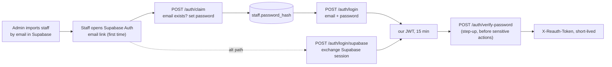

# 03 — API Specification

[← Index](README.md)

Format follows `API_Spec (3).pdf` (the Enroll backend spec) so both TCOS backends read the same
way. This document is the source of truth for route shape; `api/swagger.yaml` is generated from
it by hand and kept in step.

> **Updated 2026-07-22 against the real shipped schema.** ขัตมอส committed
> `supabase/migrations/20260101000000_init.sql` with real table/column/enum names that differ
> from what this document originally proposed — see [doc 02](02-database.md) for the full diff.
> The change that ripples furthest through this document: **reimbursement status has no separate
> draft stage.** `DRAFT/PENDING_HEAD/PENDING_FINANCE/APPROVED/TRANSFERRED/REJECTED/CANCELLED` is
> replaced by the real 6-value enum `waiting/head_approve/fin_approve/transfer/rejected/delete`,
> and creating a reimbursement puts it straight into `waiting` — there's no separate submit step.
> Every reimbursement flow below is updated to match. Table/column names throughout now use the
> shipped names: `source` (not `sources`), `payment` (not `payments`), `reimbursement` (not
> `reimbursements`), `reimbursement_detail` (not `reimbursement_details`), `bankaccount` (not
> `bank_account`), `project_tag` (not `project_tags`).

## 0. Plan → API mapping

Cross-referenced against the API section of `IT - 12 _ Development Plan.docx` (the authoritative
bullet list, not my earlier paraphrase of it). Flag legend: **✅** endpoint matches the plan
bullet directly · **🔧** plan bullet implemented, shape adjusted (bulk, split, renamed) ·
**➕** endpoint the plan implies but doesn't list explicitly · **🚫** plan bullet exists but is
**not** an API — handled manually or elsewhere.

| Plan bullet (paraphrased)                                              | Endpoint(s)            | Flag | Note                                                                                                     |
| ---------------------------------------------------------------------- | ---------------------- | ---- | -------------------------------------------------------------------------------------------------------- |
| Create a project                                                       | #18                    | ✅    |                                                                                                          |
| Bulk create project tags                                               | #23                    | ✅    |                                                                                                          |
| Bulk create project departments                                        | #27                    | ✅    |                                                                                                          |
| Modify project name/description/budget                                 | #20                    | ✅    |                                                                                                          |
| Modify tag name/budget                                                 | #24                    | ✅    |                                                                                                          |
| Modify department name/budget                                          | #28                    | ✅    |                                                                                                          |
| Delete project (admin only)                                            | #21                    | ✅    |                                                                                                          |
| Delete project tags / departments                                      | #25, #29               | ✅    |                                                                                                          |
| First-time login (Supabase Auth → claim)                               | #57                    | ➕    | plan describes the flow, doesn't name a route — see §4                                                   |
| Upload digital signature (verify identity first)                       | #60                    | ➕    | requires step-up token from #59                                                                          |
| Login / Logout — email+password                                        | #1, #2                 | ✅    |                                                                                                          |
| Login — Supabase auth service                                          | #58                    | ➕    | alternate path, plan states both must work                                                               |
| "Verify the identity" (password re-entry, step-up)                     | #59                    | ➕    | plan: *"used for creating/updating reimbursement status and checking payment slips"* — gates #40 and #47 |
| Reset password                                                         | #5, #6                 | ✅    |                                                                                                          |
| Modify staff details (not email/role)                                  | #9 (self), #12 (admin) | ✅    |                                                                                                          |
| Add / delete bank account                                              | #15, #16               | ✅    | immutable after creation, per plan                                                                       |
| `staff_dept` relations (join staff to department)                      | —                      | 🚫   | plan: *"I will manually input these info directly in supabase."* **No API.** Old #31/#32 removed         |
| Get staff info incl. departments/roles/flags/bank info                 | #4 (`/auth/me`), #8    | ✅    |                                                                                                          |
| Create / modify (not `actual_amount`) / remove a source                | #34, #35, #36          | ✅    |                                                                                                          |
| Create a payment (from Enroll/Merch)                                   | #37                    | ✅    |                                                                                                          |
| Show unchecked/checked payments by project, oldest first               | #38                    | ✅    |                                                                                                          |
| **Bulk** approve/reject payment, skip if already decided               | #40                    | ✅    |                                                                                                          |
| Create reimbursement + details + receipt                               | #41, #46               | ✅    |                                                                                                          |
| Bulk import reimbursement from CSV                                     | #49                    | ✅    |                                                                                                          |
| View / modify / delete reimbursement                                   | #43, #44, #45          | ✅    |                                                                                                          |
| Head/manager verify; **auto-verify if head submits own**               | #47                    | ✅    |                                                                                                          |
| Finance verify + `tracking_id`                                         | #47                    | ✅    | one status endpoint, many transitions                                                                    |
| Owner mark as transferred                                              | #47                    | ✅    |                                                                                                          |
| Generate ใบเบิกเงิน / ใบสำคัญจ่าย (QR, signature, censor bank details) | #48                    | ✅    |                                                                                                          |
| Summary / income-expense / top-K expenses / sponsor details            | #50, #51, #55, #56     | ✅    |                                                                                                          |
| Generate Journal                                                       | #52, #53               | ✅    |                                                                                                          |

## 1. Conventions

| | |
| --- | --- |
| Protocol | HTTPS only. HTTP redirects in production |
| Base URL | `https://<BASE_URL>/v1` — all paths below are relative |
| Format | JSON (`application/json`) except multipart upload endpoints |
| Encoding | UTF-8. Thai text throughout — no transliteration anywhere in the API |
| Auth | `Authorization: Bearer <jwt_access_token>` |
| Token | Our own JWT, RS256. Access 15 min · refresh 7 days in an HttpOnly cookie |
| First-time login | Supabase Auth (email link) → account claim → password set. See §4 |
| Step-up auth | `X-Reauth-Token: <token>` — short-lived, from `/auth/verify-password`. Required on #40, #47 |
| Service auth | `X-Service-Token: <token>` for Enroll/Merch ingress (no user context) |
| Primary keys | UUIDv7 |

### Response envelope

```jsonc
// SUCCESS
{
  "success": true,
  "data":    { /* resource or array */ },
  "meta":    { "page": 1, "limit": 20, "total": 80 }   // when paginated
}

// ERROR
{
  "success": false,
  "error": {
    "code":    "BUDGET_EXCEEDED",
    "message": "This reimbursement would exceed the department's allocated budget.",
    "field":   "details"        // optional, for validation errors
  }
}
```

### HTTP status codes

| Code | Meaning |
| --- | --- |
| `200 OK` | Successful GET, PATCH, POST that is not a creation |
| `201 Created` | Resource created |
| `204 No Content` | DELETE with no body |
| `400 Bad Request` | Validation error — `error.field` names the offender |
| `401 Unauthorized` | Missing, malformed, or expired JWT |
| `403 Forbidden` | Valid JWT, insufficient scope |
| `404 Not Found` | Resource does not exist, or caller may not know it does |
| `409 Conflict` | Duplicate (email, slip QR, tracking id) |
| `422 Unprocessable` | Business-rule rejection (budget, bad transition, amount mismatch) |
| `500 Internal Error` | Unexpected — log, alert, never leak details |

### Auth column legend

`—` public · `B` any authenticated staff · `S` service token · `head` `is_head` in the target
department · `finance` `is_finance` in the target project · `manager` `is_manager` in the target
project · `owner` global `owner` role · `admin` global `admin` role.

Roles alone are never sufficient — permission is **(role × project × department)**. See
[doc 04](04-authorization.md).

## 2. Endpoint tracking table

Update `Status` as work progresses: `Planned → In Progress → Done`.

**Owner** splits by verb/risk, not whole-domain silos: reads and bounded self-service creates go
to น้องมาร์ค; mutations, deletes, status-transitions, admin-only routes, external contracts, and
anything producing an official artifact go to ชมพู่. Full reasoning in the team-split discussion —
both people end up touching nearly every domain, and the raw split lands at 30/27.

| #   | Endpoint                       | Method     | Auth                           | Status  | Pri | Domain                                                                   | Owner        |
| --- | ------------------------------ | ---------- | ------------------------------ | ------- | --- | ------------------------------------------------------------------------ | ------------ |
| 1   | `/auth/login`                  | POST       | —                              | Planned | P0  | Auth                                                                     | ชมพู่        |
| 2   | `/auth/logout`                 | POST       | B                              | Planned | P0  | Auth                                                                     | ชมพู่        |
| 3   | `/auth/refresh`                | POST       | cookie                         | Planned | P0  | Auth                                                                     | ชมพู่        |
| 4   | `/auth/me`                     | GET        | B                              | Planned | P0  | Auth                                                                     | ชมพู่        |
| 5   | `/auth/password/forgot`        | POST       | —                              | Planned | P1  | Auth                                                                     | ชมพู่        |
| 6   | `/auth/password/reset`         | POST       | reset token                    | Planned | P1  | Auth                                                                     | ชมพู่        |
| 7   | `/staff`                       | GET        | manager                        | Planned | P1  | Staff                                                                    | มาร์ค        |
| 8   | `/staff/:id`                   | GET        | manager                        | Planned | P1  | Staff                                                                    | มาร์ค        |
| 9   | `/staff/me`                    | PATCH      | B                              | Planned | P0  | Staff                                                                    | มาร์ค        |
| 10  | `/admin/staff`                 | POST       | admin                          | Planned | P0  | Staff                                                                    | ชมพู่        |
| 11  | `/admin/staff/import`          | POST       | admin                          | Planned | P2  | Staff                                                                    | ชมพู่        |
| 12  | `/admin/staff/:id`             | PATCH      | admin                          | Planned | P1  | Staff                                                                    | ชมพู่        |
| 13  | `/admin/staff/:id`             | DELETE     | admin                          | Planned | P2  | Staff                                                                    | ชมพู่        |
| 14  | `/staff/me/bank-accounts`      | GET        | B                              | Planned | P0  | Staff                                                                    | มาร์ค        |
| 15  | `/staff/me/bank-accounts`      | POST       | B                              | Planned | P0  | Staff                                                                    | มาร์ค        |
| 16  | `/staff/me/bank-accounts/:id`  | DELETE     | B                              | Planned | P1  | Staff                                                                    | มาร์ค        |
| 17  | `/projects`                    | GET        | B                              | Planned | P0  | Project                                                                  | มาร์ค        |
| 18  | `/projects`                    | POST       | finance, admin                 | Planned | P0  | Project                                                                  | ชมพู่        |
| 19  | `/projects/:id`                | GET        | B member                       | Planned | P0  | Project                                                                  | มาร์ค        |
| 20  | `/projects/:id`                | PATCH      | manager, finance               | Planned | P0  | Project                                                                  | ชมพู่        |
| 21  | `/projects/:id`                | DELETE     | admin                          | Planned | P2  | Project                                                                  | ชมพู่        |
| 22  | `/projects/:id/tags`           | GET        | B member                       | Planned | P0  | Project                                                                  | มาร์ค        |
| 23  | `/projects/:id/tags`           | POST       | finance                        | Planned | P0  | Project                                                                  | มาร์ค        |
| 24  | `/tags/:id`                    | PATCH      | finance                        | Planned | P1  | Project                                                                  | ชมพู่        |
| 25  | `/tags/:id`                    | DELETE     | finance                        | Planned | P2  | Project                                                                  | ชมพู่        |
| 26  | `/projects/:id/departments`    | GET        | B member                       | Planned | P0  | Project                                                                  | มาร์ค        |
| 27  | `/projects/:id/departments`    | POST       | manager                        | Planned | P0  | Project (bulk)                                                           | มาร์ค        |
| 28  | `/departments/:id`             | PATCH      | manager                        | Planned | P1  | Project                                                                  | ชมพู่        |
| 29  | `/departments/:id`             | DELETE     | manager                        | Planned | P2  | Project                                                                  | ชมพู่        |
| 30  | `/projects/:id/staff`          | GET        | manager                        | Planned | P1  | Project                                                                  | มาร์ค        |
| 31  | ~~`/projects/:id/staff`~~      | ~~POST~~   | —                              | **N/A** | —   | 🚫 manual — Finance inputs `staff_dept` rows directly in Supabase Studio | —            |
| 32  | ~~`/staff-depts/:id`~~         | ~~DELETE~~ | —                              | **N/A** | —   | 🚫 manual, same reason                                                   | —            |
| 33  | `/projects/:id/sources`        | GET        | finance                        | Planned | P0  | Sources                                                                  | มาร์ค        |
| 34  | `/projects/:id/sources`        | POST       | finance                        | Planned | P0  | Sources                                                                  | ชมพู่        |
| 35  | `/sources/:id`                 | PATCH      | finance                        | Planned | P1  | Sources                                                                  | ชมพู่        |
| 36  | `/sources/:id`                 | DELETE     | finance                        | Planned | P2  | Sources                                                                  | ชมพู่        |
| 37  | `/payments`                    | POST       | **S**                          | Planned | P0  | Payments                                                                 | ชมพู่        |
| 38  | `/payments`                    | GET        | finance                        | Planned | P0  | Payments                                                                 | มาร์ค        |
| 39  | `/payments/:id`                | GET        | finance                        | Planned | P0  | Payments                                                                 | มาร์ค        |
| 40  | `/payments/approve`            | POST       | finance + step-up              | Planned | P0  | Payments (bulk)                                                          | ชมพู่        |
| 41  | `/reimbursements`              | POST       | B                              | Planned | P0  | Reimburse                                                                | มาร์ค        |
| 42  | `/reimbursements`              | GET        | B scoped                       | Planned | P0  | Reimburse                                                                | มาร์ค        |
| 43  | `/reimbursements/:id`          | GET        | owner, approver                | Planned | P0  | Reimburse                                                                | มาร์ค        |
| 44  | `/reimbursements/:id`          | PATCH      | requester (waiting/rejected)   | Planned | P1  | Reimburse                                                                | มาร์ค        |
| 45  | `/reimbursements/:id`          | DELETE     | requester                      | Planned | P1  | Reimburse                                                                | มาร์ค        |
| 46  | `/reimbursements/:id/receipt`  | POST       | requester                      | Planned | P0  | Reimburse                                                                | มาร์ค        |
| 47  | `/reimbursements/:id/status`   | POST       | head, finance, owner + step-up | Planned | P0  | Reimburse                                                                | ชมพู่        |
| 48  | `/reimbursements/:id/document` | GET        | owner, approver                | Planned | P0  | Documents                                                                | ชมพู่        |
| 57  | `/auth/claim`                  | POST       | Supabase session               | Planned | P0  | Auth                                                                     | ชมพู่        |
| 58  | `/auth/login/supabase`         | POST       | Supabase session               | Planned | P1  | Auth                                                                     | ชมพู่        |
| 59  | `/auth/verify-password`        | POST       | B                              | Planned | P0  | Auth                                                                     | ชมพู่        |
| 60  | `/staff/me/signature`          | POST       | B + step-up                    | Planned | P1  | Staff                                                                    | ชมพู่        |
| 49  | `/reimbursements/import`       | POST       | finance                        | Planned | P2  | Reimburse                                                                | ชมพู่        |
| 50  | `/reports/summary`             | GET        | B scoped                       | Planned | P0  | Reports                                                                  | มาร์ค        |
| 51  | `/reports/cashflow`            | GET        | finance, owner                 | Planned | P1  | Reports                                                                  | มาร์ค        |
| 52  | `/reports/journal`             | GET        | finance, owner                 | Planned | P1  | Reports                                                                  | มาร์ค        |
| 53  | `/reports/journal/export`      | POST       | finance, owner                 | Planned | P1  | Reports                                                                  | ชมพู่        |
| 54  | `/reports/ledger`              | GET        | finance, owner                 | Blocked | P2  | Reports                                                                  | TBD          |
| 55  | `/reports/top-expenses`        | GET        | B scoped                       | Planned | P2  | Reports                                                                  | มาร์ค        |
| 56  | `/reports/sponsors`            | GET        | finance, owner                 | Planned | P2  | Reports                                                                  | มาร์ค        |

> #54 is **Blocked** pending [open question #1](05-open-questions.md#1-ledger-and-financial-statements-are-not-reachable-from-this-schema).
>
> **Totals: ชมพู่ 30 · มาร์ค 27 · 1 blocked (#54) · 2 manual/no-API (#31, #32).** Both engineers
> touch nearly every domain — ชมพู่ owns the mutating/destructive/state-transition/admin/external-
> contract routes in each one, มาร์ค owns the reads and bounded self-service creates. Since both
> land handlers in the same router/controller files, add methods rather than editing each other's
> lines, and whoever's PR merges first on a shared file rebases the other.
> #31/#32 are struck — see [§0](#0-plan--api-mapping). #40 is bulk, not per-payment.

## 3. Page → endpoint coverage

Cross-check against the Development Plan's page list, so nothing on the frontend is left without
a route:

| Page | Endpoints |
| --- | --- |
| `/` — cash flow overview | 50, 51, 42, 17 |
| `/project/<project_id>` | 19, 22, 26, 33, 50, 55 |
| `/reimburse` — request + list | 41, 42, 46, 14 |
| `/reimburse/<reimburse_id>` | 43, 44, 45, 47, 59, **48** (print + QR verify) |
| `/checkslip` | 38, 39, 40, 59 |
| Journal export by month/project | 52, 53 |
| Project creation + management | 18, 20, 23, 27 |
| First login / account setup | 57, 58, 59, 60 |

## 4. Domain: Authentication — `/auth`

Two logins and a step-up check, per the plan — not the single RS256-JWT model I first proposed.



### `POST /auth/claim` — First-Time Login / Set Password

**Auth:** valid Supabase Auth session (from the email link)

**Flow**
1. Admin has pre-imported the staff member into Supabase by email only — no `password_hash` yet.
2. Staff follows the Supabase Auth email link; the client exchanges that for a Supabase session
   and calls this endpoint with the session token.
3. Verify the session, extract the email. Look up a live `staff` row by email.
   `404 NOT_FOUND` if the email was never imported — this is not a self-service signup route.
4. `409 ALREADY_CLAIMED` if `password_hash` is already set — direct them to `/auth/login` or
   `/auth/password/forgot` instead.
5. Validate the submitted password (≥ 8 chars), bcrypt-hash (cost 12), `$set` on `staff`.
6. Issue our own access + refresh JWT, same as `/auth/login`.

```jsonc
// POST /v1/auth/claim     Authorization: Bearer <supabase_session_token>
{ "password": "MyPass@123" }
```

**Notes**
- This route exists because staff accounts are provisioned out-of-band (bulk import into
  Supabase, per the plan), not created via public signup. There is no `POST /auth/register`.
- After this call, Supabase Auth's job is done for the session — everything downstream uses our
  own JWT and our own `password_hash`.

### `POST /auth/login` — Authenticate & Issue Tokens

**Auth:** None (public)

**Flow**
1. Validate `email` and `password` are present.
2. Find live `staff` by `email` (citext, case-insensitive). Return a generic `401` if absent —
   never distinguish unknown email from wrong password.
3. `bcrypt.compare()` against `password_hash`. `401 INVALID_CREDENTIALS` on mismatch.
4. Resolve the caller's `staff_dept` rows into the scope object (doc 04).
5. Sign the access JWT (RS256, 15 min) with `{ sub, role, nickname }`. **Scope is not in the
   token** — it is resolved per request so permission changes take effect immediately.
6. Sign the refresh JWT (7 days), set `HttpOnly; Secure; SameSite=Strict`.
7. Return `200` with the access token.

**Request**
```jsonc
{ "email": "golf@tcos.app", "password": "MyPass@123" }
```

**Response**
```jsonc
// 200 OK  |  Set-Cookie: refresh_token=...; HttpOnly; Secure
{
  "success": true,
  "data": {
    "access_token": "eyJhbGciOiJSUzI1NiIs...",
    "token_type":   "Bearer",
    "expires_in":   900,
    "staff": {
      "_id":      "018f6a2e-...",
      "nickname": "Golf",
      "email":    "golf@tcos.app",
      "role":     "finance"
    }
  }
}
```

**Notes**
- `password_hash` is never returned by any endpoint.
- Rate-limited: 5 attempts per email per 15 min, then `429`.
- bcrypt cost 12, identical to Enroll — staff accounts may be migrated between systems.

### `POST /auth/login/supabase` — Alternate Login via Supabase Auth

**Auth:** valid Supabase Auth session

**Flow**
1. Verify the Supabase session, extract email.
2. Look up live `staff` by email. `404` if not found or `password_hash` never set (send them to
   `/auth/claim` instead).
3. Skip the password check entirely — Supabase already authenticated them — and issue our own
   access + refresh JWT exactly as `/auth/login` would.

**Notes**
- The plan lists this as a parallel login method, not a replacement for email+password. Both must
  keep working.
- Same rate limiting and audit logging as `/auth/login`, keyed by the resolved staff id.

### `POST /auth/verify-password` — Step-Up Verification

**Auth:** Bearer (an existing, valid access token)

**Flow**
1. Decode the Bearer JWT — `sub` gives the staff id. Does **not** accept an expired token; this
   is a *re*-confirmation of an active session, not a login.
2. `bcrypt.compare()` the submitted password against `staff.password_hash`.
   `401 INVALID_CREDENTIALS` on mismatch — same generic message as login, same rate limit.
3. Issue a short-lived `X-Reauth-Token` (signed, 5 min), scoped to this `staff_id` only.
4. Routes that require step-up (#40 bulk payment approval, #47 reimbursement status changes,
   #60 signature upload) check for a **valid, unexpired** `X-Reauth-Token` matching the caller's
   `staff_id`, in addition to the normal Bearer check. Missing or stale → `401 REAUTH_REQUIRED`.

```jsonc
// POST /v1/auth/verify-password     Authorization: Bearer <access_token>
{ "password": "MyPass@123" }

// 200 OK
{ "success": true, "data": { "reauth_token": "eyJ...", "expires_in": 300 } }
```

**Notes**
- Plan: *"Verify the identity — inputs only the password (and checks from JWT). This is mostly
  used for creating/updating reimbursement status and checking payment slips."* This is a
  step-up/reauth pattern (see [doc 04](04-authorization.md#9-step-up-verification)), not a second
  full login — the existing JWT still carries identity and scope.
- 5-minute TTL balances "Finance approves a batch of ten slips without re-typing their password
  every time" against "a token doesn't linger long enough to matter if leaked."

### `GET /auth/me` — Current staff + full scope

**Auth:** Bearer

Returns the staff profile **plus the resolved scope**, so the frontend can render navigation
without guessing at permissions.

```jsonc
// 200 OK
{
  "success": true,
  "data": {
    "_id":        "018f6a2e-...",
    "title":      "นาย",
    "first_name": "สมชาย",
    "last_name":  "ใจดี",
    "nickname":   "Golf",
    "email":      "golf@tcos.app",
    "phone":      "0812345678",
    "line_id":    "golf_tcos",
    "role":       "finance",
    "signature_image": "https://.../signatures/018f.png",
    "scope": {
      "memberships": [
        { "project_id": "018e...", "project_name": "The Coming of Stages 3",
          "department_id": "018d...", "department_name": "ฝ่ายการเงิน",
          "is_head": false, "is_finance": true, "is_manager": false }
      ],
      "head_of":    [],
      "finance_of": ["018e..."],
      "manager_of": []
    }
  }
}
```

### `POST /auth/logout` — Terminate Session

**Auth:** Bearer

**Flow**
1. Verify the Bearer token (accepted even if just-expired — only the `sub` claim is needed).
2. Clear the `refresh_token` cookie (`Max-Age=0`).
3. Add the token's `jti` to a short-lived denylist (keyed on the access token's own remaining TTL,
   max 15 min) so a token captured moments before logout can't still be replayed.
4. Return `204 No Content`.

**Notes**
- The client is responsible for discarding the access token from memory — this call only
  invalidates the refresh path and the short remainder of the current access token's life.

### `POST /auth/refresh` — Rotate Access Token

**Auth:** `refresh_token` HttpOnly cookie (no Bearer header required)

**Flow**
1. Read and verify the `refresh_token` cookie. `401 TOKEN_EXPIRED` if missing, invalid, or past
   7 days.
2. Re-resolve the staff record — `404` if the account was deleted since the refresh token was
   issued.
3. Issue a new access JWT (15 min). Rotate the refresh cookie (new token, new 7-day window) so a
   stolen-but-unused refresh token has a shrinking usable lifetime.
4. Return `200` with the new access token, same shape as `/auth/login`.

**Notes**
- Silent, called by the frontend's HTTP client on a 401 before surfacing anything to the user.
- Refresh rotation means a refresh token is single-use in practice — reusing an old one after
  rotation is a signal worth logging (possible token theft).

### `POST /auth/password/forgot` — Request Password Reset

**Auth:** None (public)

**Flow**
1. Validate `email` is present.
2. Look up live `staff` by email. **Always return `200` regardless of whether the email exists**
   — this route must not leak account existence.
3. If found, generate a signed, single-use reset token (JWT, 30 min expiry), and email a reset
   link containing it via the transactional email provider.
4. Return `200` unconditionally.

```jsonc
{ "email": "golf@tcos.app" }
// 200 OK — always, regardless of whether the email exists
{ "success": true, "data": { "message": "If that email exists, a reset link has been sent." } }
```

**Notes**
- Rate-limited per email and per IP to blunt enumeration-by-timing and mail-bombing.

### `POST /auth/password/reset` — Complete Password Reset

**Auth:** reset token (from the emailed link, passed in the body — not a Bearer header)

**Flow**
1. Verify the reset token signature and expiry. `401 TOKEN_EXPIRED` if past 30 min or already used.
2. Validate the new password (≥ 8 chars). Bcrypt-hash (cost 12), `$set staff.password_hash`.
3. Invalidate the reset token (single-use — mark consumed, e.g. same denylist pattern as logout).
4. Invalidate all existing refresh tokens for this staff member — a password reset should end
   every other logged-in session, not just issue a new credential alongside old ones.
5. Return `204`.

```jsonc
{ "reset_token": "eyJ...", "password": "NewPass@456" }
```

## 5. Domain: Staff — `/staff`

> **`staff_dept` (department membership, `is_head`/`is_finance`/`is_manager`) has no API.**
> Per the plan: *"For staff_dept relation, I will manually input these info directly in
> supabase. Just be sure to check the user's table schema."* `GET /staff/:id` and `GET /auth/me`
> must still surface these fields correctly — the schema is our responsibility even though the
> writes aren't.

### `GET /staff` — List Staff

**Auth:** Bearer, `is_manager` on at least one project

**Query:** `?department_id=` `?project_id=` `?page=&limit=`

**Flow**
1. Verify the caller is `is_manager` somewhere. `403` otherwise — this is not a general staff
   directory.
2. If `project_id`/`department_id` given, scope results to that project/department; otherwise
   scope to every project the caller manages.
3. Return a paginated list: name, nickname, email, phone, and their `staff_dept` flags —
   **not** `password_hash`, never.

### `GET /staff/:id` — Get One Staff Member

**Auth:** Bearer, `is_manager` on a project the target staff member belongs to

**Flow**
1. Load `staff` by `:id`. `404` if not found.
2. Verify the caller manages at least one project the target is a member of. `403` otherwise.
3. Return the profile plus `staff_dept` memberships (including ones in departments/projects the
   caller doesn't manage — the plan asks for "departments, roles, is_head/is_manager/is_finance"
   as a full picture) and bank account summaries (masked numbers).

### `PATCH /staff/me` — Update Own Profile

**Auth:** Bearer

**Flow**
1. Whitelist allowed fields: `nickname`, `phone`, `line_id`, `title`. Reject any other field with
   `400 VALIDATION_ERROR` — **`email` and `role` are never editable through this route**, per the
   plan ("Except email and role, admin only").
2. If `phone` changes, validate the format (`^[0-9]{9,10}$`).
3. `$set` on `staff`, `updated_at` bumped by trigger.
4. Return `200` with the full updated profile, same shape as `GET /auth/me`.

### `POST /admin/staff` — Provision a Staff Account

**Auth:** admin

**Flow**
1. Verify `role === 'admin'`. `403` otherwise.
2. Validate required fields: `first_name`, `last_name`, `nickname`, `email`. `password_hash` is
   **not** set here — provisioning creates the identity only; the staff member sets their own
   password via `POST /auth/claim`.
3. `409 DUPLICATE_EMAIL` if the email is already live.
4. Insert into `staff`. Return `201`.

```jsonc
{ "title": "นางสาว", "first_name": "มาลี", "last_name": "สุขใส",
  "nickname": "เมย์", "email": "may@tcos.app", "phone": "0898765432" }
```

**Notes**
- This is the API-driven equivalent of the manual Supabase import the plan describes — useful
  once the admin panel exists, but the manual path stays valid for bulk onboarding.

### `POST /admin/staff/import` — Bulk Provision from CSV

**Auth:** admin

**Flow**
1. Verify admin. Accept `multipart/form-data`, field `file`, CSV only.
2. Parse with `CSV.util.js` (Papaparse). Required columns: `first_name`, `last_name`, `nickname`,
   `email`; optional: `title`, `phone`, `line_id`.
3. Validate every row before writing anything — collect all errors (bad email format, duplicate
   email within the file, duplicate against existing `staff`) and return them together rather
   than failing on the first bad row.
4. If validation passes, insert all rows in one transaction. If it doesn't, insert nothing and
   return `400` with a per-row error list.
5. Return `201` with a count and the created staff summaries.

**Notes**
- All-or-nothing on purpose — a half-imported CSV is harder to reconcile than a rejected one.

### `PATCH /admin/staff/:id` — Admin Update Staff

**Auth:** admin

**Flow**
1. Verify admin. Load target `staff`, `404` if not found.
2. Whitelist: everything `PATCH /staff/me` allows, **plus** `email` and `role`.
3. If `email` changes, check uniqueness. Note `staff.email` is plain `TEXT UNIQUE`, not `citext`
   ([doc 02 §6](02-database.md#6-gaps-between-the-2026-07-20-decisions-and-the-shipped-migration)
   gap #4) — the DB won't catch `Golf@tcos.app` vs `golf@tcos.app` as a duplicate, so this check
   must lowercase both sides itself until the column type is fixed. `409 DUPLICATE_EMAIL` either
   way.
4. `role` is currently a plain manual field — there is no `trg_staff_role` deriving it from
   `staff_dept` flags (gap #9), so setting it here simply sets it, with no risk of a later trigger
   silently overwriting it. If that trigger is ever added, this route's behavior would need
   revisiting.
5. Return `200` with the updated profile.

### `DELETE /admin/staff/:id` — Deactivate Staff

**Auth:** admin

**Flow**
1. Verify admin. Load target, `404` if not found.
2. Soft-delete: `$set deleted_at`. **Does not cascade** — historical reimbursements, approvals,
   and payment decisions attributed to this staff member remain exactly as they are (see the
   `staff_dept_id` orphaning note in [doc 02](02-database.md#known-modelling-gaps)).
3. Return `204`.

**Notes**
- A deactivated staff member can no longer log in (`/auth/login` checks `deleted_at IS NULL`),
  but every document they ever approved still renders correctly.

### `POST /staff/me/signature` — Upload Digital Signature

**Auth:** Bearer + `X-Reauth-Token` (step-up required)

**Flow**
1. Verify the reauth token — `401 REAUTH_REQUIRED` if missing or stale. Plan: *"Verify the
   identity first"* before accepting a signature.
2. Accept `multipart/form-data`, field `signature`. PNG only (transparency matters for overlay
   onto the PDF templates), ≤ 2 MB. Sniff magic bytes.
3. Upload to the private R2 `signatures` bucket at `{staff_id}/{uuid}.png` via `R2.util.js`,
   replacing any previous signature (one live signature per staff member, not a history).
4. `$set staff.signature_image` to the R2 object key. Reads go through short-lived presigned R2
   URLs, same as receipts.
5. Return `200`.

**Notes**
- A signature image is not cryptographic proof of anything — it's a visual match to current
  paper practice. See [open question #13](05-open-questions.md#13-digital-signature-approach) for
  the fuller discussion of what "digital signature" should mean here.

### `GET /staff/me/bank-accounts` — List Own Bank Accounts

**Auth:** Bearer

**Flow**
1. Query `bankaccount` by `req.scope.staffId`, live rows only.
2. Return full, unmasked account numbers — this is the owner's own view. Masking applies only
   when a bank account is surfaced through *someone else's* request (a reimbursement document,
   an admin listing).

### `DELETE /staff/me/bank-accounts/:id` — Remove a Bank Account

**Auth:** Bearer, owner of the account

**Flow**
1. Load the account, `404` if not found or not live. `403` if it belongs to a different staff
   member.
2. Soft-delete (`$set deleted_at`) — never hard-deleted, so a reimbursement that already points at
   this account keeps rendering with the correct historical digits.
3. Return `204`.

### `POST /staff/me/bank-accounts` — Add Bank Account

**Auth:** Bearer

**Flow**
1. Validate `number` is 10–12 digits, `provider` and `name` present.
2. Reject a duplicate live account with the same `number` for this staff member — `409`.
3. Insert against `req.scope.staffId`. **The account is never updatable afterwards** — enforced
   only by never exposing a `PATCH` route for it; there's no DB trigger backing that up yet
   ([doc 02 §6](02-database.md#6-gaps-between-the-2026-07-20-decisions-and-the-shipped-migration)
   gap #10). Corrections mean soft-delete plus a new row.
4. Return `201`.

```jsonc
// POST /v1/staff/me/bank-accounts
{ "name": "สมชาย ใจดี", "number": "1234567890", "provider": "กสิกรไทย" }
```

**Notes**
- Immutability is deliberate: an approved reimbursement must keep pointing at the digits Finance
  actually verified. Editing the row would silently rewrite financial history.
- Account numbers are masked (`xxxxxx7890`) everywhere except the requester's own view and the
  rendered ใบสำคัญจ่าย.

## 6. Domain: Projects — `/projects`

### `GET /projects` — List Projects

**Auth:** Bearer

**Query:** `?page=&limit=`

**Flow**
1. Scope results to projects the caller has a live `staff_dept` membership in, **unless** the
   caller is `finance`, `owner`, or `admin` globally, who see every live project.
2. Return summary fields only (`_id`, `name`, `allocated_budget`, `total_income`,
   `total_expense`) — full detail is `GET /projects/:id`.

### `POST /projects` — Create a Project

**Auth:** `finance` or `admin`

**Flow**
1. Verify the caller's global role is `finance` or `admin`. `403` otherwise — project creation is
   not project-scoped, since the project doesn't exist yet to scope against.
2. Validate `name` (required), `description`, `allocated_budget` (defaults 0).
3. Insert. `total_income`/`total_expense` initialise to 0, never client-settable.
4. Return `201`.

```jsonc
{ "name": "The Coming of Stages 3", "description": "ปีที่ 3", "allocated_budget": 50000000 }
```

### `GET /projects/:id` — Project Detail

**Auth:** Bearer, member of the project (or `finance`/`owner`/`admin` globally)

**Flow**
1. Load `project` by `:id`, `404` if not found or soft-deleted.
2. Verify membership (any live `staff_dept` row in any department under this project) unless the
   caller has a global override role. `403` otherwise.
3. Return the full project record — this is the data source for `/project/<project_id>`.

### `PATCH /projects/:id` — Update Project

**Auth:** `is_manager` or `is_finance` on the project

**Flow**
1. Verify scope. `403` otherwise.
2. Whitelist: `name`, `description`, `allocated_budget`. `total_income`/`total_expense` are never
   client-writable — `400 VALIDATION_ERROR` if present in the body.
3. `$set` the change. **`allocated_budget` changes are the one gap in the audit trail** — see
   [open question #12](05-open-questions.md#12-budget-change-audit-trail); once a
   `budget_changes` table exists, this route writes to it in the same transaction.
4. Return `200` with the updated project.

### `DELETE /projects/:id` — Delete Project

**Auth:** admin

**Flow**
1. Verify `role === 'admin'`. `403` otherwise — this is deliberately narrower than the
   PATCH/manage scope.
2. Check for any live tag/department/source/reimbursement referencing this project. `409
   CONFLICT` if any exist — a project with financial activity is never deletable, only
   soft-deletable after every child record is itself resolved (a manual, deliberate process, not
   a cascading one-call delete).
3. If clear, `$set deleted_at` on the project.
4. Return `204`.

### `GET /projects/:id/tags` — List Tags

**Auth:** Bearer, member of the project

**Flow**
1. Verify membership. `403` otherwise.
2. Return live tags with their `allocated_budget`/`total_income`/`total_expense`.

### `POST /projects/:id/tags` — Bulk Create Tags

**Auth:** Bearer, `is_finance` on the project

**Flow**
1. Verify `is_finance` for `:id`, else `403 NOT_PROJECT_MEMBER`.
2. Validate the array — each entry needs `name`; `allocated_budget` defaults to 0.
3. Reject names already live in the project — `409 DUPLICATE_TAG`, `error.field` gives the index.
4. Insert all in **one transaction** — partial success on a bulk endpoint is a support burden.
5. `total_income` / `total_expense` initialise to 0 and are never client-settable.
6. Return `201` with the created rows.

```jsonc
{ "tags": [
    { "name": "ค่าสถานที่",  "allocated_budget": 5000000 },
    { "name": "ค่าอาหาร",    "allocated_budget": 2000000 }
] }
```

**Notes**
- Amounts are satang — ฿50,000.00 is `5000000`.
- Tags carry both income and expense; departments carry expense only. Budget-vs-actual is
  therefore answerable per tag *and* per department, which is what `/project/<id>` renders.

### `PATCH /tags/:id` — Update Tag

**Auth:** `is_finance` on the tag's project

**Flow**
1. Load the tag, resolve its project, verify `is_finance` there. `403` otherwise.
2. Whitelist: `name`, `allocated_budget`. `total_income`/`total_expense` never client-writable.
3. `409 DUPLICATE_TAG` if renaming collides with another live tag in the same project.
4. Return `200`.

### `DELETE /tags/:id` — Delete Tag

**Auth:** `is_finance` on the tag's project

**Flow**
1. Verify scope. Check for any live `source` or `reimbursement` rows referencing this tag —
   `409 CONFLICT` if any exist, same reasoning as project deletion: a tag with financial history
   attached is never silently removable.
2. If clear, `$set deleted_at`.
3. Return `204`.

### `GET /projects/:id/departments` — List Departments

**Auth:** Bearer, member of the project

**Flow**
1. Verify membership. `403` otherwise.
2. Return live departments with `allocated_budget`/`total_expense`.

### `POST /projects/:id/departments` — Bulk Create Departments

**Auth:** `is_manager` on the project

**Flow**
1. Verify `is_manager` for `:id`. `403 NOT_PROJECT_MEMBER` otherwise.
2. Validate the array — each entry needs `name`; `allocated_budget` defaults to 0. Same shape and
   same one-transaction-for-the-whole-batch rule as bulk tag creation.
3. Reject names already live in the project — `409 DUPLICATE_DEPARTMENT`, `error.field` gives the
   index.
4. Return `201` with the created rows.

```jsonc
{ "departments": [
    { "name": "ฝ่ายเวที",         "allocated_budget": 2000000 },
    { "name": "ฝ่ายประชาสัมพันธ์", "allocated_budget": 800000 }
] }
```

### `PATCH /departments/:id` — Update Department

**Auth:** `is_manager` on the department's project

**Flow**
1. Load the department, resolve its project, verify `is_manager` there. `403` otherwise.
2. Whitelist: `name`, `allocated_budget`. `total_expense` never client-writable.
3. `409 DUPLICATE_DEPARTMENT` on a colliding rename.
4. Return `200`.

### `DELETE /departments/:id` — Delete Department

**Auth:** `is_manager` on the department's project

**Flow**
1. Verify scope. Check for live `staff_dept` memberships or `reimbursements` referencing this
   department — `409 CONFLICT` if any exist.
2. If clear, `$set deleted_at`.
3. Return `204`.

**Notes**
- In practice this route is rarely reachable: a department with any history has memberships or
  reimbursements against it, and those block the delete. That's intentional — a department is a
  financial category, not just an org-chart node.

### `GET /projects/:id/staff` — List Project Staff

**Auth:** `is_manager` on the project

**Flow**
1. Verify `is_manager` for `:id`. `403 NOT_PROJECT_MEMBER` otherwise — this is the one staff-list
   route scoped to *managing*, not just *belonging to*, matching the plan's "(Manager) can see
   staff info."
2. Join `staff_dept` → `staff` for every department under this project.
3. Return name, nickname, department, and flags (`is_head`/`is_finance`/`is_manager`) per row —
   the same shape `staff_dept` writes are missing (§0), but the read side is fully ours to build.

## 7. Domain: Sources — `/projects/:id/sources`

### `GET /projects/:id/sources` — List Funding Sources

**Auth:** `is_finance` on the project

**Query:** `?type=` `?tag_id=`

**Flow**
1. Verify `is_finance` for `:id`. `403` otherwise — sources expose expected vs. actual income,
   which is finance-sensitive even before any payment attaches to them.
2. Return live sources, optionally filtered by `type` or `tag_id`.

### `POST /projects/:id/sources` — Create a Funding Source

**Auth:** Bearer, `is_finance` on the project

**Flow**
1. Verify `is_finance` on `:id`.
2. `project_id` is set directly from `:id` — a source belongs to its project unconditionally,
   `project_id NOT NULL` in the schema. `tag_id` is **optional**; if given, validate it belongs
   to `:id` — `422 TAG_PROJECT_MISMATCH` on a cross-project tag.
3. Enforce `reference_id`: required for `enroll`/`merch`, must be null for `spon`/`other` — this
   is an API-layer check only, there's no DB constraint enforcing it (unlike most of this schema,
   which does use `CHECK` constraints).
4. Insert. **Intended** behavior: for `spon`/`other`, `actual_amount` mirrors `expected_amount`
   immediately; for `enroll`/`merch` it stays 0 until slips are approved. **As shipped, no trigger
   does this** — see [doc 02 §6](02-database.md#6-gaps-between-the-2026-07-20-decisions-and-the-shipped-migration)
   gap #1. Until that trigger exists, `Source.helper.js` must set `actual_amount` explicitly on
   insert for `spon`/`other` types.
5. Return `201`.

```jsonc
{
  "type":            "spon",
  "name":            "บริษัท กล้วยหอมจอมซน จำกัด",
  "tag_id":          null,
  "expected_amount": 5000000,
  "reference_id":    null
}
```

**Notes**
- `actual_amount` is never client-writable on any route.
- An `enroll` source's `reference_id` is Enroll's `activity_id`; this is the join that lets
  `POST /payments` find the right source without Enroll knowing our ids.
- Amounts are `INTEGER` (satang) in the shipped schema, matching the 2026-07-20 decision.

### `PATCH /sources/:id` — Update Source

**Auth:** `is_finance` on the source's project

**Flow**
1. Load the source — `project_id` is a direct column, so no join through `tag_id` is needed to
   find which project to check scope against. Verify `is_finance` on `source.project_id`. `403`
   otherwise.
2. Whitelist: `name`, `expected_amount`, `tag_id` (re-tagging, or clearing it to `null`, validated
   against the same `project_id` — `422 TAG_PROJECT_MISMATCH` if it would imply a different
   project). **Never** `actual_amount`, `type`, `reference_id`, or `project_id` — changing what a
   source *is* or which project it belongs to after payments exist against it would desync
   whatever is (or will be) maintaining `actual_amount`.
3. Return `200`.

### `DELETE /sources/:id` — Delete Source

**Auth:** `is_finance` on the source's project

**Flow**
1. Verify scope. Check for any live `payments` referencing this source — `409 CONFLICT` if any
   exist, same pattern as tag/department deletion: a source with recorded income is never
   silently removable.
2. If clear, `$set deleted_at`.
3. Return `204`.

## 8. Domain: Payments — `/payments`

### `POST /payments` — Ingest a Payment from Enroll/Merch

**Auth:** `X-Service-Token` (no user context)

**Flow**
1. Verify the service token — `401` otherwise. This route is not reachable with a user JWT.
2. Resolve the source: match `source` on `(type, reference_id)`. `404 SOURCE_NOT_FOUND` if the
   activity/store has no configured source — Finance must create it first.
3. Insert with `_id` = the caller's `registration_id` / `purchase_id`. `payment._id` has a
   server-side default, but this route must always pass `_id` explicitly — otherwise a retry
   generates a second row instead of hitting the same one. On PK conflict return `200` with the
   existing record — **this endpoint is idempotent** so Enroll can safely retry.
4. Insert the initial `payment_updatestatus` row with `status: 'waiting'`.
5. Return `201`.

```jsonc
// POST /v1/payments     X-Service-Token: <token>
{
  "_id":               "018f...",          // registration_id | purchase_id
  "user_id":           "018e...",
  "type":              "enroll",
  "reference_id":      "018a...",          // activity_id
  "expected_amount":   50000,
  "promptpay_qr_data": "00020101021229370016A000000677010111..."
}
```

**Notes**
- Idempotency is required, not optional. Cross-service HTTP retries are a matter of when.
- **Duplicate `promptpay_qr_data` detection has no DB backstop yet** — the shipped schema has no
  unique index on it ([doc 02 §6](02-database.md#6-gaps-between-the-2026-07-20-decisions-and-the-shipped-migration)
  gap #5). Until that index exists, `Payment.helper.js` must explicitly check for an existing
  live row with the same `promptpay_qr_data` before inserting, accepting that this is a
  check-then-insert race until the index lands.
- We store the QR string, never the slip image. Finance scans it on mobile to read the real
  amount — matching the Development Plan, and it keeps us out of storing payment images.

### `GET /payments` — List / Checkslip Queue

**Auth:** `is_finance` on the target project

**Query:** `?project_id=` (required) `?status=waiting|approved|rejected` `?page=&limit=`

**Flow**
1. Verify `is_finance` for `project_id`. `403` otherwise.
2. Join `payment` → latest `payment_updatestatus` → `source`, filtered to `source.project_id`
   and (optionally) status — `source.project_id` makes this a direct filter now, no need to go
   through `project_tag`.
3. Sort `created_at ASC` — **oldest first**, matching the plan's "order from payment_time; oldest
   payment show first." This is the exact query behind `/checkslip`.
4. Return paginated results with `expected_amount`, current status, and the source it funds.

### `GET /payments/:id` — Payment Detail

**Auth:** `is_finance` on the payment's project

**Flow**
1. Resolve payment → source → project, verify `is_finance`. `403` otherwise.
2. Return the payment plus its **full** `payment_updatestatus` history (not just latest) — this
   is the detail view Finance opens from the checkslip queue before deciding.

### `POST /payments/approve` — Bulk Approve / Reject Slips

**Auth:** Bearer, `is_finance` on every payment's project + `X-Reauth-Token` (step-up required)

Plan: *"Bulk Approve/Reject payment… remember to update `actual_amount` for every related
attribute… when other finance members already approve the payment (in the payload), do not do
anything."* Two things follow from that: the request is an **array**, and the endpoint is
**idempotent per item** — safe for two finance staff to submit overlapping batches from
`/checkslip` without erroring on each other.

**Flow**
1. Verify the reauth token — `401 REAUTH_REQUIRED` otherwise.
2. For each `{ payment_id, status, actual_amount? }` in the body, **independently**:
   a. Resolve payment → source, using `source.project_id` directly. `403` if the caller lacks
      `is_finance` there — this failure is per-item, not batch-wide.
   b. Read the latest `payment_updatestatus`. If it is already `approved` **or** `rejected`
      (i.e. someone else's concurrent request already decided it), **skip silently** — record it
      as `skipped` in the response, not an error. This is the exact race the plan calls out.
   c. Otherwise validate the transition (`waiting → approved`, `waiting → rejected`,
      `rejected → waiting`) and require `actual_amount` on approval.
   d. Insert a new status row. Never update the previous one.
   e. **On approval, also update `source.actual_amount` (and cascade to `project_tag`/`project`
      totals) explicitly, in the same per-item transaction.** No trigger does this yet — see
      [doc 02 §6](02-database.md#6-gaps-between-the-2026-07-20-decisions-and-the-shipped-migration)
      gap #1. This step is the whole reason the transaction boundary in step 3 matters: if the
      rollup write fails, the status insert must roll back with it.
3. All items run in one transaction *per payment*, not one transaction for the whole batch —
   a bad row must not roll back the nine good ones next to it.
4. Return `200` with a per-item result array — this is a partial-success endpoint by design.

```jsonc
// POST /v1/payments/approve     X-Reauth-Token: <token>
{
  "decisions": [
    { "payment_id": "018f...", "status": "approved", "actual_amount": 50000 },
    { "payment_id": "018g...", "status": "rejected" },
    { "payment_id": "018h...", "status": "approved", "actual_amount": 30000 }
  ]
}

// 200 OK
{
  "success": true,
  "data": {
    "results": [
      { "payment_id": "018f...", "outcome": "approved", "amount_matches": true },
      { "payment_id": "018g...", "outcome": "rejected" },
      { "payment_id": "018h...", "outcome": "skipped",
        "reason": "Already approved by another finance staff at 09:10." }
    ]
  }
}
```

**Notes**
- Whether an amount mismatch on approval is a hard rejection or an accepted-and-flagged approval
  is a Finance policy call — [open question #9](05-open-questions.md). This endpoint supports
  both; pick one before build.
- `GET /payments?status=waiting&project_id=...` is the `/checkslip` queue. Default sort
  `created_at ASC` — oldest slip first, matching the plan's "order from payment_time, oldest
  shown first."
- A single-item batch is just this endpoint called with one decision — there is no separate
  per-payment approval route.

## 9. Domain: Reimbursements — `/reimbursements`

### `POST /reimbursements` — Create a Reimbursement Request

**Auth:** Bearer

**There is no draft stage.** Unlike this document's earlier draft, the shipped
`reimbursement_available_status` enum has no `DRAFT` value — a reimbursement is created directly
into `waiting` and is immediately visible in the approval queue. Whatever used to be "required
before submit" is now required **at creation time**, since there's no later submit call to defer
it to.

**Flow**
1. Resolve `staff_dept_id`: caller must be a live member of the department. `403` otherwise.
2. Validate `tag_id`, if given (it's optional), belongs to the same project as that department —
   `422 TAG_PROJECT_MISMATCH`.
3. Validate `details` is non-empty and every `amount > 0` — enforced at the API layer;
   `reimbursement_detail.amount` has no DB-level `CHECK` yet
   ([doc 02 §6](02-database.md#6-gaps-between-the-2026-07-20-decisions-and-the-shipped-migration)
   gap #8).
4. If `banking_id` is given, it must be a live account **owned by the caller** — `403` otherwise.
   Null means "pay me in cash".
5. **Receipt.** Decide before build whether a receipt must be attached at creation (single
   multipart call combining the record + the file) or whether creation is allowed without one and
   the first head-approval attempt is what enforces it. Either is workable now that there's no
   separate submit step — this doc previously assumed the latter via a submit call that no longer
   exists.
6. Budget check: warn (do not block) if the total would push the department over
   `allocated_budget`. Return the projection in `meta` so the UI can surface it.
7. Insert reimbursement + details + the initial `waiting` status row, all in one transaction. If
   the requester is themselves head of the target department, also insert a `head_approve` row in
   the same transaction — see the auto-verify note under the status endpoint below.
8. Return `201`.

```jsonc
{
  "department_id": "018d...",
  "tag_id":        null,
  "purpose":       "ค่าอุปกรณ์ประกอบฉากรอบซ้อมใหญ่",
  "banking_id":    "018b...",
  "details": [
    { "title": "ผ้าม่านเวที",   "amount": 120000 },
    { "title": "ค่าขนส่ง",      "amount":  35000 }
  ]
}
```

```jsonc
// 201 Created
{
  "success": true,
  "data": {
    "_id":           "018f...",
    "latest_status": "waiting",
    "purpose":       "ค่าอุปกรณ์ประกอบฉากรอบซ้อมใหญ่",
    "tracking_id":   null,
    "receipt_link":  null,
    "details":       [ /* ... */ ],
    "created_at":    "2026-07-20T08:00:00.000Z"
  },
  "meta": {
    "budget": { "department_allocated": 2000000, "department_used": 1900000,
                "would_exceed": true, "over_by": 55000 }
  }
}
```

**Notes**
- No `total_amount` field in the response — there's no cached column for it yet
  ([doc 02 §6](02-database.md#6-gaps-between-the-2026-07-20-decisions-and-the-shipped-migration)
  gap #2). Compute it client-side from `details`, or have the API sum it at read time until the
  column exists.
- Budget overrun warns rather than blocks: real productions overspend and Finance still needs the
  paperwork. Blocking would push people off-system, which is exactly what this project exists to
  prevent.

### `GET /reimbursements` — List Reimbursements

**Auth:** Bearer, scoped

**Query:** `?status=` `?department_id=` `?project_id=` `?mine=true` `?page=&limit=`

**Flow**
1. Default scope: reimbursements the caller **requested**, or is an eligible **approver** for at
   their current stage (`isHead` of the department for `waiting` rows, `isFinance` of the project
   for `head_approve` rows). `finance`/`owner`/`admin` globally see everything.
2. Apply filters. `?mine=true` narrows to requester-only, for the "my requests" view on
   `/reimburse`.
3. Return `latest_status` straight from its cached column — no join needed for the list view (see
   [doc 02](02-database.md)). There is no equivalent cache for the total yet; either omit it from
   the list view or compute it per row with a `SUM` join until gap #2 is closed.

### `GET /reimbursements/:id` — Reimbursement Detail

**Auth:** requester, any approver in the chain, `finance`, or `owner`

**Flow**
1. Load the reimbursement with `details` and full `reimbursement_updatestatus` history.
2. Authorize: requester, or someone who is/was an eligible approver at the current or a past
   stage, or a global override role. `403` otherwise.
3. Return the full record, including `receipt_link` resolved to a short-lived presigned R2 URL
   (not the raw object key) so the frontend can display it directly.

### `PATCH /reimbursements/:id` — Edit Reimbursement

**Auth:** requester, status `waiting` or `rejected`

**Flow**
1. Verify ownership and editable status — `422 INVALID_TRANSITION` otherwise. Once a reimbursement
   moves to `head_approve` or past, it is not editable; cancel and recreate instead, so the audit
   trail never shows an approver signing off on content that later changed. **Note the accepted
   trade-off**: because `waiting` covers both "just created" and "sitting in the head's queue,"
   editing while `waiting` is technically possible right up until the head clicks approve — the
   same race any single-state "pending" design has. Nothing in the schema distinguishes those two
   moments.
2. Whitelist: `purpose`, `tag_id` (re-validated against the department's project, or cleared to
   `null`), `banking_id`, and the `details` array (full replace — delete-and-reinsert inside a
   transaction).
3. Re-run the same budget-warning projection as `POST /reimbursements`.
4. Return `200` with the updated record.

### `DELETE /reimbursements/:id` — Cancel Reimbursement

**Auth:** requester

**Flow**
1. Verify ownership. Look up the `→ delete` transition in `Approval.helper.js` — valid from
   `waiting` or `rejected` (see [doc 04](04-authorization.md#4-reimbursement-state-machine)).
   `422 INVALID_TRANSITION` from `head_approve` onward, and always from `transfer`.
2. Insert a `delete` status row — nothing is ever hard-removed, regardless of how early the
   cancellation happens. There's no special-cased hard-delete path now that there's no draft
   stage to hard-delete from.
3. Return `204`.

**Notes**
- The name is `DELETE` for REST convention; the record and its full history remain in place.

### `POST /reimbursements/:id/receipt` — Upload Receipt

**Auth:** Bearer, requester only, status `waiting` or `rejected`

**Flow**
1. Verify ownership and that status is editable — `422 INVALID_TRANSITION` otherwise.
2. Accept `multipart/form-data`, field `receipt`. Accept PDF/PNG/JPEG only, ≤ 10 MB.
3. **Sniff the magic bytes** — never trust `Content-Type` or the filename extension.
4. Downscale images over 2000px on the long edge; recompress PDFs over 2 MB.
5. Upload to the private R2 `receipts` bucket at `{project_id}/{reimbursement_id}/{uuid}.{ext}`
   via `R2.util.js`.
6. Store the **object key** in `receipt_link`, never a public URL. Reads go through short-lived
   presigned R2 URLs so receipts can't leak by link-sharing.
7. Return `200`.

### `POST /reimbursements/:id/status` — Advance the Approval Chain

**Auth:** depends on the target status — `head`, `finance`, `owner`, or the requester —
**plus `X-Reauth-Token`** (step-up required on every status change, per the plan)

**Flow**
1. Verify the reauth token — `401 REAUTH_REQUIRED` otherwise.
2. Load the reimbursement — `latest_status` is read straight off the cached column, no need to
   query `reimbursement_updatestatus` for "where is this right now."
3. Look up the transition in `Approval.helper.js` (doc 04). Unknown → `422 INVALID_TRANSITION`.
4. Check the caller holds the flag that transition demands, against **this** project/department.
   `403 FORBIDDEN` otherwise.
5. Transition-specific rules:
   - `waiting → head_approve` — **if the requester is themselves head of the target department,
     this fires automatically at creation time** (see `POST /reimbursements` step 7) rather than
     needing a separate call here — the plan: *"When the head makes the reimbursement,
     automatically verify (as a head of the department) upon submit."* When a *different* head
     approves, it's a normal call to this endpoint.
   - `head_approve → fin_approve` — assign `tracking_id` (from the body, or the sequence if we own
     numbering — [open question #3](05-open-questions.md#3-who-owns-tracking_id-numbering)).
   - `fin_approve → transfer` — `owner` role only. **This is where expense should be
     recognised.** As shipped, nothing rolls the total up to department/tag/project automatically
     — `Approval.helper.js` must do it explicitly in this same transaction until
     [doc 02 §6](02-database.md#6-gaps-between-the-2026-07-20-decisions-and-the-shipped-migration)
     gap #1 is closed.
   - `→ rejected` — `reason` required; stored on the status row.
6. Insert a new status row inside a transaction with any side effects. The `trg_sync_reimbursement_latest_status`
   trigger updates `reimbursement.latest_status` automatically on insert — the API doesn't need to
   set it itself.
7. Return `200` with the updated reimbursement and full history.

```jsonc
{ "status": "fin_approve", "tracking_id": "TCOS3-0042" }
```

**Notes**
- Auto-verify only fires for the **head-level** check. Finance approval and owner transfer still
  require a separate, different person — the plan does not extend the auto-pass any further, and
  collapsing those would remove the only independent checks money gets before it moves.
- Every transition is logged with `staff_id`, giving Finance a complete approval trail per
  document, including the auto-verified ones.

### `GET /reimbursements/:id/document` — Render ใบเบิกเงิน / ใบสำคัญจ่าย

**Auth:** Bearer — requester, any approver in the chain, finance, or owner

**Query:** `?type=request|voucher` (required) · `?format=pdf|html` (default `pdf`)

**Flow**
1. Authorize. `403` otherwise.
2. Load reimbursement + details + history + staff + department + project + tag + bank account.
3. **Mask the bank account number** before it ever reaches the template
   (`xxxxxx7890`) — the plan explicitly asks to *"consider censoring bankaccount details"* on the
   rendered document. Full digits render only when the viewer is the requester, `is_finance`, or
   `owner`; everyone else sees the masked form even in the PDF.
4. Pick the template: `request` → ใบเบิกเงิน · `voucher` → ใบสำคัญจ่าย. Anything else →
   `400 VALIDATION_ERROR`.
5. Compute the Thai baht text via `Money.util.toThaiText()` — "หนึ่งพันห้าร้อยห้าสิบบาทถ้วน".
   Required on ใบสำคัญจ่าย.
6. Generate the verification QR → `https://<BASE_URL>/reimburse/<id>`, embed bottom-right as a
   data URI.
7. Inline `signature_image` for approvals already collected; leave ruled blank lines for pending
   ones so the form can be signed on paper.
8. Render A4 through the pooled Puppeteer browser. Respond `application/pdf`,
   `Content-Disposition: inline; filename="reimburse-<tracking_id>.pdf"`.
9. `422 NOT_APPROVED` if `type=voucher` and `latest_status` has not reached `fin_approve` (or
   `transfer`) — a voucher for an unapproved request is a forgeable document.

**Notes**
- **Templates are not built from scratch.** The plan links a template repo —
  [`thecomingofstages/finance-pdfgenerator`](https://github.com/thecomingofstages/finance-pdfgenerator)
  — for ใบเบิกเงิน. Sprint 0 should include pulling that repo and confirming what it already
  covers before `templates/reimbursement-request.hbs` is written; ใบสำคัญจ่าย likely still needs
  building fresh, the repo covers the request form only per the plan's wording.
- `format=html` exists for template development and for previewing in-browser; it renders the
  same Handlebars output without the Puppeteer round-trip.
- Puppeteer runs one pooled browser, not one per request. Cold start is ~1s; a pool keeps p95
  render under 500ms.
- **Thai font must be embedded in the container image** (Sarabun or Noto Sans Thai). Headless
  Chrome on a slim base image renders Thai as tofu boxes. This surprises everyone once.

### `POST /reimbursements/import` — Bulk Import from Google Form CSV

**Auth:** `is_finance` on the target project

**Flow**
1. Verify `is_finance`. Accept `multipart/form-data`, field `file`, CSV only.
2. Parse with `CSV.util.js`. Column mapping is configured per project (Google Form column headers
   are not guaranteed stable across forms) — required at minimum: requester email, department
   name, purpose, and one-or-more amount/title pairs.
3. Resolve each row's requester by email → `staff`, department by name → `department` (scoped to
   the target project). Row-level `400` if either lookup fails, collected and returned together
   rather than failing the whole batch on the first bad row.
4. For rows that resolve, insert as reimbursements. **They land in `waiting` immediately** —
   there's no draft state to land them in instead, so an imported row is in the approval queue
   the moment it's created, receipt or not. If Finance wants imported (often already-spent,
   historical) rows to *not* immediately page a department head, that's a product decision worth
   raising explicitly — the schema doesn't offer a quiet middle state.
5. Return `201` with a per-row result: created, or the specific validation error.

**Notes**
- This is explicitly an import, not a migration — imported rows still go through the full
  approval chain from `waiting`. It exists to avoid re-keying historical Google Form submissions
  by hand, not to backfill already-approved history.

## 10. Domain: Reports — `/reports`

### `GET /reports/summary` — Dashboard Totals

**Auth:** Bearer, scoped — results limited to the caller's projects unless finance/owner/admin

**Query:** `?project_id=` `?tag_id=` `?department_id=` `?from=` `?to=`

Reads the trigger-maintained aggregates directly — no `SUM` at read time, which is what keeps the
`/` dashboard fast as the data grows.

```jsonc
// 200 OK
{
  "success": true,
  "data": {
    "total_income":     12500000,
    "total_expense":     8300000,
    "net_income":        4200000,
    "allocated_budget": 15000000,
    "budget_used_pct":       55.3,
    "outstanding_reimbursements": { "count": 7, "amount": 450000 },
    "pending_slips":             { "count": 12 },
    "by_tag": [
      { "tag_id": "018c...", "name": "ค่าสถานที่",
        "allocated_budget": 5000000, "total_income": 0, "total_expense": 4800000 }
    ],
    "by_department": [
      { "department_id": "018d...", "name": "ฝ่ายเวที",
        "allocated_budget": 2000000, "total_expense": 1900000 }
    ]
  }
}
```

### `GET /reports/journal` — สมุดรายวัน

**Auth:** finance, owner

**Query:** `?project_id=` `?month=2026-07` `?from=` `?to=`

**Flow**
1. Verify scope (`finance`/`owner` globally, or `is_finance` on `project_id` if given).
2. Run the UNION query from [doc 02](02-database.md#journal-query) — approved-payment income
   rows and transferred-reimbursement expense rows, ordered by date.
3. Return as a flat array: `{ entry_date, side, description, amount, tag, project }` per row —
   this is the raw shape both the on-screen journal view and the export below consume.

### `POST /reports/journal/export` — Export Journal

**Auth:** finance, owner

**Query/body:** same filters as `GET /reports/journal`, plus `format: "xlsx" | "pdf"`

**Flow**
1. Same authorization and query as `GET /reports/journal`.
2. Render to the requested format: `xlsx` via a sheet-writing library, one row per journal entry,
   grouped/subtotalled by month if `?group_by=month`; `pdf` via the same Puppeteer pool as
   Documents, using `templates/journal.hbs`.
3. Respond with the file directly (`Content-Disposition: attachment`), not a stored link — this
   is generated fresh per request, nothing is cached server-side.

**Notes**
- This is the "Export รายรับรายจ่ายเป็น Journal แยกตามเดือน / Project" requirement from the
  requirement PDF, and the only report endpoint that's a `POST` — it's request-scoped generation,
  not a cheap read, so it doesn't pretend to be idempotent-cacheable like the `GET` reports.

### `GET /reports/ledger` — บัญชีแยกประเภท (Ledger)

**Status: Blocked.** Not reachable from the current schema — there is no chart of accounts, so
there is no "account" to group a ledger by. See
[open question #1](05-open-questions.md#1-ledger-and-financial-statements-are-not-reachable-from-this-schema)
for the three scoping options and why v1 recommends dropping this endpoint rather than
half-building it. Do not implement against a guessed shape — the response contract depends
entirely on which option Finance picks.

### `GET /reports/top-expenses` — Top-K Most Expensive Line Items

**Auth:** Bearer, scoped (same rule as `/reports/summary`)

**Query:** `?project_id=` `?limit=5` (default 5, "Top 5 most expensive expenses?" per the plan)

**Flow**
1. Scope as in `/reports/summary`.
2. Query `reimbursement_detail` joined to reimbursements where `latest_status = 'transfer'` only
   (unrealized expenses don't count toward "most expensive" — only money actually spent), ordered
   by `amount DESC`, limited to `?limit`.
3. Return each with its parent reimbursement's purpose, department, and tag for context.

### `GET /reports/sponsors` — Sponsor Details per Project

**Auth:** finance, owner

**Query:** `?project_id=`

**Flow**
1. Verify scope.
2. Query `source WHERE type = 'spon' AND project_id = :project_id`, with `expect_amount` and
   `actual_amount`. **Intended** to always be equal for sponsor sources (mirrored on insert); as
   shipped, nothing enforces that mirroring — see
   [doc 02 §6](02-database.md#6-gaps-between-the-2026-07-20-decisions-and-the-shipped-migration)
   gap #1. Until it's automatic, `Source.helper.js` must set `actual_amount = expect_amount`
   explicitly whenever a `spon`/`other` source is created.
3. Return sponsor name, amount, and the tag they're categorised under (if tagged — `tag_id` is
   optional) — this answers the plan's "Get sponsor details for each project" directly.

### `GET /reports/cashflow` — Cash Flow Breakdown

**Auth:** finance, owner

**Query:** `?project_id=` `?from=` `?to=`

**Flow**
1. Verify scope.
2. Aggregate three views in one response: income by `source.type`, expense by department, expense
   by tag — each read straight from the trigger-maintained totals, no ad-hoc `SUM`.
3. Build a monthly time series from the journal query (§ above), bucketed by `entry_date`'s month,
   for the trend chart on `/`.
4. Return budget-vs-actual per department (`allocated_budget` vs `total_expense`) alongside.

Powers the `/` page's "where did the money go" view: income by source type, expense by department
and by tag, monthly time series, and budget-vs-actual per department.

## 11. Error code reference

Enroll's table, extended. Reuse Enroll's codes verbatim where they apply.

| Code | HTTP | Description |
| --- | --- | --- |
| `VALIDATION_ERROR` | 400 | Missing or malformed request field |
| `RECEIPT_REQUIRED` | 400 | Reimbursement can't proceed to head approval without a receipt attached |
| `INVALID_CREDENTIALS` | 401 | Email or password incorrect |
| `TOKEN_EXPIRED` | 401 | JWT access token has expired |
| `FORBIDDEN` | 403 | Insufficient scope for this operation |
| `NOT_PROJECT_MEMBER` | 403 | Caller has no live `staff_dept` row in the target project |
| `NOT_FOUND` | 404 | Requested resource does not exist |
| `SOURCE_NOT_FOUND` | 404 | No configured source for this activity/store |
| `DUPLICATE_EMAIL` | 409 | Email already registered |
| `ALREADY_CLAIMED` | 409 | Staff account already has a password set |
| `DUPLICATE_PAYMENT` | 409 | This slip QR has already been used |
| `DUPLICATE_TAG` | 409 | Tag name already exists in this project |
| `DUPLICATE_TRACKING_ID` | 409 | Tracking id already assigned |
| `REAUTH_REQUIRED` | 401 | Missing or expired `X-Reauth-Token` on a step-up route |
| `INVALID_TRANSITION` | 422 | Status change not allowed from the current state |
| `ALREADY_APPROVED` | 422 | Payment is already approved (terminal) |
| `AMOUNT_MISMATCH` | 422 | Slip amount does not match the expected amount |
| `TAG_PROJECT_MISMATCH` | 422 | Tag does not belong to the department's project |
| `BUDGET_EXCEEDED` | 422 | Would exceed allocated budget (only where enforced) |
| `NOT_APPROVED` | 422 | Voucher requested for a reimbursement that is not approved |
| `INTERNAL_ERROR` | 500 | Unexpected server error — check logs |

> `SELF_APPROVAL` (from the first draft) is removed — self-approval at head level is now an
> **auto-verify**, not a rejection. See #47 above and [doc 04](04-authorization.md#4-reimbursement-state-machine).

## 12. Architectural constraints (summary)

| | |
| --- | --- |
| Database | PostgreSQL (Supabase). All `_id` are UUIDv7 |
| ORM | Sequelize v6, class-per-model, `sync: false` |
| Schema owner | Supabase CLI SQL migrations |
| Payment | PromptPay QR data only — **we never store slip images** |
| Aggregates | **Intended** to be trigger-maintained deltas, no `SUM`/`COUNT` at read time. As shipped, no such triggers exist yet — the API layer must maintain them explicitly until [doc 02 §6](02-database.md#6-gaps-between-the-2026-07-20-decisions-and-the-shipped-migration) gap #1 is closed |
| Soft delete | `deleted_at` on tables that support end-user deletion; `paranoid: true`. The two pure log tables (`payment_updatestatus`, `reimbursement_updatestatus`) correctly have none |
| Audit | Status tables are append-only |
| Auth | Own RS256 JWT for sessions (15 min / 7 days). Supabase Auth for first-time claim + alt login only |
| Step-up | `X-Reauth-Token` (5 min) required before bulk payment approval or any reimbursement status change |
| Scope | Resolved per request from `staff_dept` — never cached in the token |
| `staff_dept` writes | **Manual**, direct in Supabase Studio — no API |
| Documents | Puppeteer + Handlebars, A4, Thai font embedded in the image |
| Storage | Cloudflare R2 (S3-compatible), private bucket, presigned URLs only |
| Expense recognition | Should happen at `transfer`, not at approval — not yet automatic, see Aggregates above |
| Reimbursement states | `waiting · head_approve · fin_approve · transfer · rejected · delete` — no separate draft stage |


