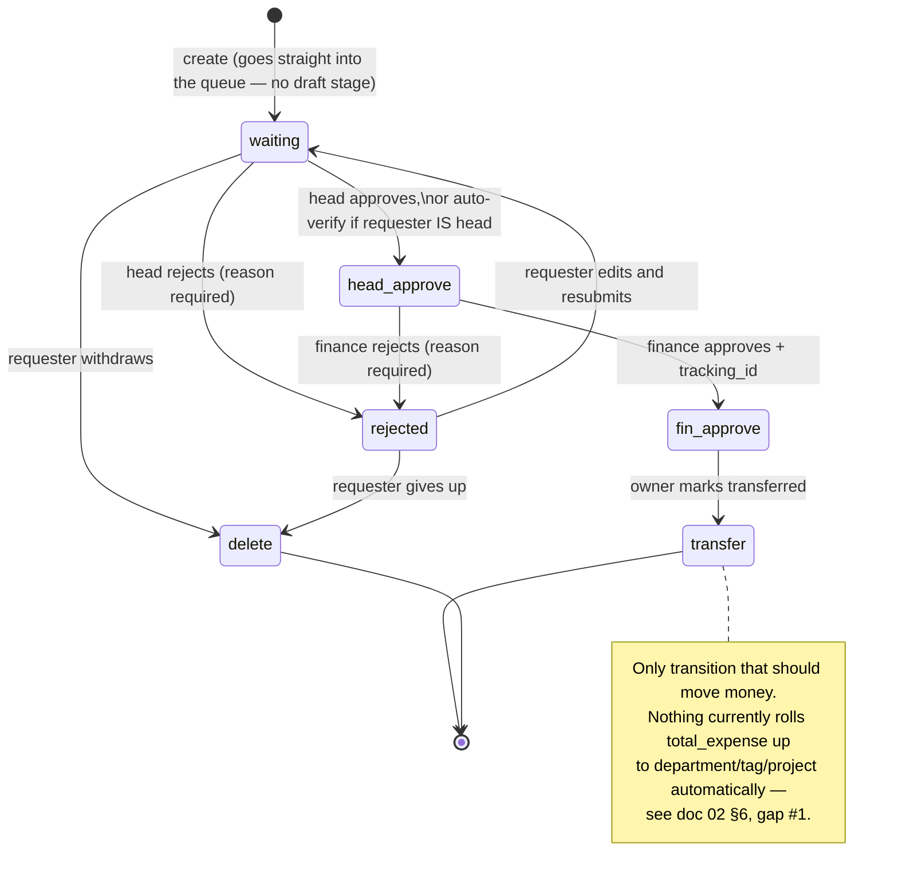
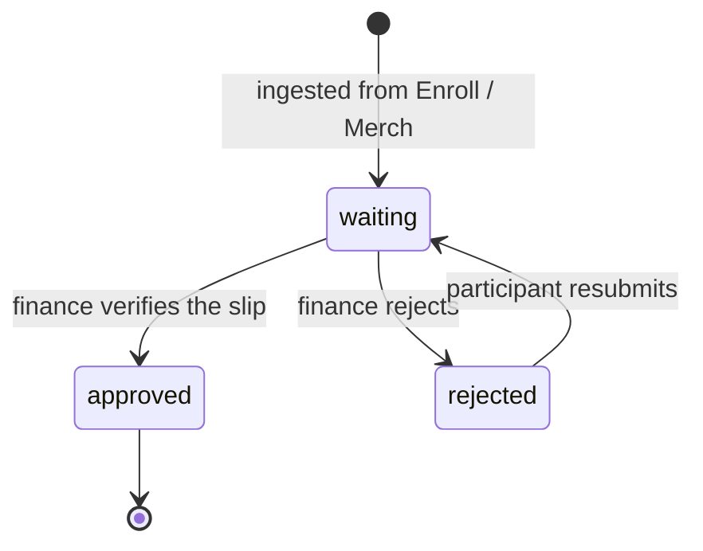

# 04 — Authorization & State Machines

[← Index](README.md)

## 1. Why roles alone don't work

`STAFF.role` is a global label. Every meaningful permission in this system is **local**:

> Mr. A is head of ฝ่ายเวที in project M, an ordinary member of ฝ่ายประชาสัมพันธ์ in project M,
> and finance for project P.

He may approve reimbursements from ฝ่ายเวที, not from ฝ่ายประชาสัมพันธ์, and he may approve slips
for P but not M. A global `role = 'finance'` cannot express that.

Permission is therefore **(role × project × department)**, resolved from `STAFF_DEPT`. The
`role` column is a convenience derived by trigger for coarse checks and UI hints — it is never
the sole gate on a route.

## 2. Scope resolution

`Auth.middleware.js` runs on every authenticated request and attaches:

```js
req.scope = {
  staffId:    "018f...",
  role:       "finance",            // global label from STAFF
  memberships: [                    // live STAFF_DEPT rows, joined up to project
    { staffDeptId, departmentId, projectId, isHead, isFinance, isManager }
  ],
  departments: ["018d..."],         // flattened, for fast membership checks
  headOf:      ["018d..."],         // department ids
  financeOf:   ["018e..."],         // project ids
  managerOf:   ["018e..."],         // project ids
  isGlobal:    false,               // true for owner / admin
}
```

**Scope is resolved per request, never stored in the JWT.** If it lived in the token, promoting
someone to head of department wouldn't take effect until their access token expired — and, worse,
*removing* someone's approval rights would leave a 15-minute window where they could still
approve. One indexed query on `staff_dept` is a cheap price for correctness.

Cache within the request only. If it becomes a measured bottleneck, a short-TTL cache keyed by
`staffId` with explicit invalidation on `staff_dept` writes is the next step — not before.

## 3. Permission matrix

| Capability | Who | Resolved against |
| --- | --- | --- |
| Create / delete a project | `finance`, `admin` | global |
| Manage project details, tags, budgets | `isFinance` or `isManager` | that project |
| Manage departments, add/remove staff | `isManager` | that project |
| View project staff details | `isManager` | that project |
| Manage sources, approve payments | `isFinance` | that project |
| Create a reimbursement | any member | that department |
| First-level approve a reimbursement | `isHead` | that department |
| Second-level approve + assign tracking id | `isFinance` | that project |
| Mark as transferred | `owner` role | global (พราว) |
| View any reimbursement | requester, any approver in the chain, `isFinance` of the project | mixed |
| View reports | scoped to `memberships`; unrestricted for `finance`, `owner`, `admin` | mixed |
| Edit staff email or role | `admin` | global |
| Delete a project | `admin` | global |

Expressed in routes as a declarative guard, so the rule is visible at the route definition rather
than buried in a helper:

```js
router.post(
  "/:id/sources",
  Auth.verifyJWT,
  Auth.resolveScope,
  Auth.require("isFinance", req => req.params.id),        // project id resolver
  Validate.body(CreateSourceSchema),
  SourceController.create
);

router.post(
  "/:id/status",
  Auth.verifyJWT,
  Auth.resolveScope,
  // guard is transition-dependent — Approval.helper decides, then the helper enforces
  Validate.body(UpdateStatusSchema),
  ReimbursementController.updateStatus
);
```

## 4. Reimbursement state machine

**Superseded 2026-07-22.** This section previously proposed a 7-state
`DRAFT/PENDING_HEAD/PENDING_FINANCE/APPROVED/TRANSFERRED/REJECTED/CANCELLED` enum, pending
Finance sign-off. ขัตมอส has since shipped the real
`reimbursement_available_status` type in `supabase/migrations/20260101000000_init.sql` — **6
states, no separate draft stage.** This section now documents that, not a proposal.

```sql
CREATE TYPE reimbursement_available_status AS ENUM (
  'waiting', 'rejected', 'delete', 'head_approve', 'fin_approve', 'transfer'
);
```



**The biggest practical change from the old design: there is no DRAFT state.** A reimbursement is
created directly into `waiting` and is immediately in the approval queue. This means:

- `POST /reimbursements` can no longer assume "create as draft, submit later." Whatever the API
  requires before a reimbursement is creatable (receipt uploaded? at least one detail line?) has
  to be enforced **at creation time**, not at a separate submit step — there is no later step to
  defer it to.
- The old two-step "`DRAFT → PENDING_HEAD` via a submit call" collapses into one: create = submit.
  [Doc 03](03-api-spec.md)'s `POST /reimbursements` and `POST /reimbursements/:id/status` flows
  need rewriting to match — flagged there.
- Editing before anyone has looked at it (my old `PATCH` in `DRAFT`) now means editing while in
  `waiting`, i.e. before the head has acted. `PATCH` should probably still be allowed there, since
  functionally it's the same "nobody's approved this yet" window — just renamed.

### Transition table

Implemented as a single frozen map in `Approval.helper.js`. One table, one source of truth — not
scattered `if` statements across controllers.

| From | To | Who | Extra requirements |
| --- | --- | --- | --- |
| — | `waiting` | any member of the department | ≥1 detail line, whatever else is required at creation (see above) |
| `waiting` | `head_approve` | `isHead` of the department | see auto-verify below |
| `waiting` | `rejected` | `isHead` of the department | `reason` |
| `waiting` | `delete` | requester | — |
| `head_approve` | `fin_approve` | `isFinance` of the project | `tracking_id` |
| `head_approve` | `rejected` | `isFinance` of the project | `reason` |
| `fin_approve` | `transfer` | `owner` role | — |
| `rejected` | `waiting` | requester | — |
| `rejected` | `delete` | requester | — |

Anything not in this table is `422 INVALID_TRANSITION`. `transfer` and `delete` are terminal — a
mistaken transfer is corrected by a new adjusting record, never by editing history.

**Head self-approval — resolved, not a decision to make.** The Development Plan's API section is
explicit: *"When the head makes the reimbursement, automatically verify (as a head of the
department) upon submit."* So `waiting → head_approve` is not blocked for a head filing their own
request — it **auto-fires** the moment the reimbursement is created, if `req.scope.headOf`
includes the target department. `Approval.helper.create()` inserts *two* status rows in one
transaction (`waiting`, then immediately `head_approve`), both attributed to the requester, so
`reimbursement_updatestatus` — and therefore the `latest_status` cache — records that the step
ran rather than showing a gap. This **only** applies to the head level — finance approval and the
owner's transfer still require a different person each; nothing in the plan extends the auto-pass
past `head_approve`, and doing so would remove the only two genuinely independent checks a
reimbursement gets before money moves.

**Test requirement:** `Approval.helper.js` gets 100% branch coverage. Every cell in the table
above, the auto-verify branch specifically (requester-is-head vs. requester-is-not-head), plus a
rejection test for every transition *not* in the table. This is the one file where a bug silently
corrupts financial records — doubly so now that [doc 02 §6](02-database.md#6-gaps-between-the-2026-07-20-decisions-and-the-shipped-migration)
means the expense rollup, if it exists at all yet, likely lives in this same helper rather than a
trigger.

## 5. Payment state machine

Simpler, and shorter-lived:



`approved` is terminal. A reversal is a manual adjustment, not a status flip — otherwise
`source.actual_amount` can be walked up and down and the audit trail stops meaning anything.

`waiting → approved` is *supposed* to move `actual_amount` and cascade it into `total_income` —
that's still the intended design. As of the shipped migration **nothing does this automatically**
(see [doc 02 §6](02-database.md#6-gaps-between-the-2026-07-20-decisions-and-the-shipped-migration),
gap #1). Until a trigger exists, `Payment.helper.js`'s approve path must update
`source.actual_amount` (and cascade to `project_tag`/`project`) explicitly, inside the same
transaction as the `payment_updatestatus` insert.

## 6. Service-to-service auth

`POST /payments` is called by Enroll and Merch, not by a human. It uses
`X-Service-Token: <token>` — a long random secret in env, compared with
`crypto.timingSafeEqual`, one token per calling service so either can be rotated alone.

Rules:
- Service-token routes are **never** reachable with a user JWT, and user routes are never
  reachable with a service token. Two separate middlewares, no shared path.
- Rate-limited by source IP and logged with the calling service name.
- Route allowlist per token: the Enroll token may only reach `POST /payments`. If a token leaks,
  the blast radius is one endpoint.
- Rotate quarterly; keep the previous token valid for a 24h overlap.

See [open question #7](05-open-questions.md#7-enroll--merch-integration-contract-is-unwritten) —
this contract needs writing with the Enroll team before sprint 3.

## 7. Row-Level Security posture

The API connects with the service-role key and **bypasses RLS**. Authorization is enforced in
`Auth.middleware.js`, and that is the real gate.

We still write RLS policies (a follow-up migration — the shipped
`20260101000000_init.sql` has none yet), for two reasons:

1. `web/` may later read some tables directly with the anon key — dashboard reads are the
   obvious candidate — and RLS is the only thing standing between that and a data leak.
2. A policy is executable documentation of the intended access rule, checkable against the
   middleware.

**RLS is a second layer, not the first.** Do not let a route ship with "RLS will catch it" as its
authorization story — the service-role key means it won't.

## 8. Auditability

Finance needs to answer "who approved this, and when" for every baht. What we keep:

| Question | Answered by |
| --- | --- |
| Who approved this slip? | `payment_updatestatus.staff_id` + `created_at` |
| Who approved this reimbursement, at each stage? | `reimbursement_updatestatus` full history |
| What did the request look like when approved? | `reimbursement_detail` rows are soft-deleted, never updated in place |
| Which bank account was the money sent to? | `bankaccount` rows are *intended* to be immutable — enforced only by the API never exposing an update route; no DB trigger backs this up yet ([doc 02 §6](02-database.md#6-gaps-between-the-2026-07-20-decisions-and-the-shipped-migration) gap #10) |
| Was the slip real? | `promptpay_qr_data` is retained, but **not** uniquely indexed yet (gap #5) — duplicate-slip detection currently has no DB-level backstop |
| Who created or changed a budget? | **Not currently captured** — see below |

Budget changes (`allocated_budget` on project, tag, department) are the one financially material
edit with no audit trail. Either add a generic `AUDIT_LOG` table, or accept that budgets are
mutable-without-history. Worth raising with Finance — my recommendation is a small append-only
`budget_changes` table, since "who raised ฝ่ายเวที's budget by ฿50,000 and when" is exactly the
kind of question that gets asked after the fact.

## 9. Step-up verification

The plan's Staff section describes a distinct check beyond "has a valid JWT":

> *"Verify the identity — inputs only the password (and checks from JWT). This is mostly used for
> creating/updating reimbursement status and checking payment slips."*

This is a **step-up / reauth** pattern, common where a session can stay open a while but the
financially consequential actions inside it demand a fresh proof of identity — the same shape as
a password prompt before changing a payment method. It is not a second full login: the Bearer JWT
still carries identity and scope, and `resolveScope` still runs normally.

**Mechanics**
1. `POST /auth/verify-password` takes the current Bearer token + the plaintext password,
   `bcrypt.compare()`s it against `staff.password_hash`, and — on success — issues a short-lived
   `X-Reauth-Token` (signed, 5 min, scoped to that `staff_id`).
2. `Auth.requireReauth` middleware sits in front of the gated routes. It checks the header is
   present, signature-valid, unexpired, and that its `staff_id` matches `req.scope.staffId` —
   catching a stale token copied from a different session.
3. Missing or expired → `401 REAUTH_REQUIRED`, distinct from `401 TOKEN_EXPIRED` so the frontend
   can show "re-enter your password" instead of forcing a full re-login.

**Gated routes:** `POST /payments/approve` (bulk slip approval), `POST /reimbursements/:id/status`
(every transition), `POST /staff/me/signature`. All three either move money or produce a document
that claims to represent an approval — exactly where a hijacked-but-still-valid session should not
be enough.

**Why 5 minutes, not per-action:** Finance works through the `/checkslip` queue or an approval
chain in a burst — one reauth should cover the batch, not demand a password on every click. Five
minutes is long enough for a realistic batch and short enough that a leaked token is a narrow
window, not a standing risk.

This sits alongside, not instead of, the scope model in §2 — `X-Reauth-Token` proves *this is
still really them*; `req.scope` proves *they're allowed to do this specific thing*. Both checks
run on every gated route.
