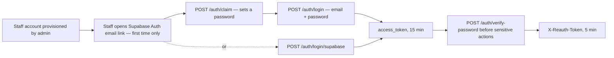

# TCOS Finance Tracking — API Reference (Frontend)

Version 0.1.0 · Draft · Base URL `https://<BASE_URL>/v1`

This is the contract your frontend code integrates against: every endpoint, what to send, what
you get back, and what can go wrong. Backend implementation detail (database, triggers, ORM) is
deliberately left out — see the companion Backend Implementation Reference if you need that.

## 1. Conventions

| | |
| --- | --- |
| Protocol | HTTPS only |
| Format | JSON, except file upload endpoints which are `multipart/form-data` |
| Encoding | UTF-8. Thai text throughout — never transliterate |
| Auth header | `Authorization: Bearer <access_token>` |
| Access token | Expires in 15 minutes. Call `POST /auth/refresh` on a 401 before giving up |
| Refresh | An HttpOnly cookie your JS never touches directly — the browser sends it automatically |
| Step-up header | `X-Reauth-Token: <token>` — required on a few sensitive routes, see §3 |
| Primary keys | All IDs are UUIDv7 strings |

### Response envelope

Every response follows the same shape:

```jsonc
// Success
{
  "success": true,
  "data":    { /* the resource, or an array of resources */ },
  "meta":    { "page": 1, "limit": 20, "total": 80 }   // present on paginated lists
}

// Error
{
  "success": false,
  "error": {
    "code":    "BUDGET_EXCEEDED",
    "message": "This reimbursement would exceed the department's allocated budget.",
    "field":   "details"   // present on validation errors — which field to highlight
  }
}
```

Always branch on `success`, not on HTTP status alone — `error.code` is the stable value to switch
on in UI logic; `error.message` is for display, not parsing.

### HTTP status codes

| Code | Meaning | What to do |
| --- | --- | --- |
| `200` | OK | Normal read/update |
| `201` | Created | Resource created — `data` has the new record |
| `204` | No Content | Success, nothing returned — DELETE mostly |
| `400` | Validation error | Show `error.field` inline on the form |
| `401` | Not authenticated | Try `POST /auth/refresh` once, then redirect to login |
| `403` | Forbidden | User is logged in but not allowed — don't retry, don't refresh |
| `404` | Not found | Resource doesn't exist, or user isn't allowed to know it does |
| `409` | Conflict | Something duplicate — usually a "this already exists" message |
| `422` | Business rule | Domain-specific rejection — always check `error.code` for which one |
| `429` | Rate limited | Back off; login and password endpoints are limited |
| `500` | Server error | Generic "something went wrong," log it, don't show details |

## 2. Auth integration guide

Two ways in, plus a step-up check for sensitive actions.



**First login**: a new staff member doesn't self-register. They receive a Supabase Auth email
link (admin-provisioned account, no password yet). Following that link gives you a Supabase
session token — exchange it via `POST /auth/claim` to set a password and get our own access
token back. From then on, it's `POST /auth/login` with email+password like anything else.

**Step-up ("verify identity")**: a handful of routes — bulk payment approval, every reimbursement
status change, and signature upload — require a **second, short-lived token** on top of your
normal Bearer token. Call `POST /auth/verify-password` (just the password, current session
required) to get an `X-Reauth-Token` good for 5 minutes, then send it alongside the Bearer token
on the gated call. Prompt for this like a "confirm your password to continue" dialog — it's not a
full re-login, the user's session stays intact throughout.

**Session refresh**: access tokens are short (15 min) on purpose. On any `401`, call
`POST /auth/refresh` once (it reads the refresh cookie automatically) and retry the original
request before giving up and redirecting to login.

## 3. Error code reference

| Code | HTTP | Meaning |
| --- | --- | --- |
| `VALIDATION_ERROR` | 400 | Missing/malformed field — see `error.field` |
| `RECEIPT_REQUIRED` | 400 | Can't submit a reimbursement without a receipt uploaded first |
| `INVALID_CREDENTIALS` | 401 | Wrong email/password — generic on purpose, don't say which |
| `TOKEN_EXPIRED` | 401 | Access token expired — refresh and retry |
| `REAUTH_REQUIRED` | 401 | Missing/expired `X-Reauth-Token` — prompt for password again |
| `FORBIDDEN` | 403 | Logged in, not allowed to do this |
| `NOT_PROJECT_MEMBER` | 403 | Not a member of the target project |
| `NOT_FOUND` | 404 | Resource doesn't exist |
| `SOURCE_NOT_FOUND` | 404 | No funding source configured for this activity/store yet |
| `DUPLICATE_EMAIL` | 409 | Email already registered |
| `ALREADY_CLAIMED` | 409 | This account already has a password — go to login instead |
| `DUPLICATE_PAYMENT` | 409 | This payment slip has already been used |
| `DUPLICATE_TAG` / `DUPLICATE_DEPARTMENT` | 409 | Name already used in this project |
| `DUPLICATE_TRACKING_ID` | 409 | Tracking ID already assigned to another reimbursement |
| `INVALID_TRANSITION` | 422 | This status change isn't allowed from where the record is now |
| `ALREADY_APPROVED` | 422 | Payment already approved — can't change it |
| `AMOUNT_MISMATCH` | 422 | Slip amount doesn't match what was expected |
| `TAG_PROJECT_MISMATCH` | 422 | Chosen tag doesn't belong to the same project as the department |
| `BUDGET_EXCEEDED` | 422 | Would exceed the allocated budget (shown as a warning, not always blocking — check `meta.budget`) |
| `NOT_APPROVED` | 422 | Requested a payment voucher for a reimbursement that isn't approved yet |
| `INTERNAL_ERROR` | 500 | Unexpected — show a generic error, don't retry automatically |

## 4. Page → endpoint map

What each page in the plan needs, so you know what to wire up where.

| Page | Endpoints |
| --- | --- |
| `/` — cash flow overview | `GET /reports/summary`, `GET /reports/cashflow`, `GET /reimbursements`, `GET /projects` |
| `/project/<project_id>` | `GET /projects/:id`, `GET /projects/:id/tags`, `GET /projects/:id/departments`, `GET /projects/:id/sources`, `GET /reports/summary`, `GET /reports/top-expenses` |
| `/reimburse` — request + list | `POST /reimbursements`, `GET /reimbursements`, `POST /reimbursements/:id/receipt`, `GET /staff/me/bank-accounts` |
| `/reimburse/<id>` | `GET /reimbursements/:id`, `PATCH /reimbursements/:id`, `DELETE /reimbursements/:id`, `POST /reimbursements/:id/status`, `POST /auth/verify-password`, `GET /reimbursements/:id/document` (print + the QR verification link points back here) |
| `/checkslip` | `GET /payments`, `GET /payments/:id`, `POST /payments/approve`, `POST /auth/verify-password` |
| Journal export | `GET /reports/journal`, `POST /reports/journal/export` |
| Project creation + management | `POST /projects`, `PATCH /projects/:id`, `POST /projects/:id/tags`, `POST /projects/:id/departments` |
| First login / account setup | `POST /auth/claim`, `POST /auth/login/supabase`, `POST /auth/verify-password`, `POST /staff/me/signature` |

**Not available yet**: `GET /reports/ledger` (บัญชีแยกประเภท) is blocked pending a backend
schema decision — don't build UI against it until it moves off "Blocked."

## 5. Domain: Authentication — `/auth`

### `POST /auth/claim` — First login, set a password
**Auth:** Supabase Auth session token (from the emailed link)

Exchanges a Supabase session for our own account + password, one time only.

```jsonc
// Request   Authorization: Bearer <supabase_session_token>
{ "password": "MyPass@123" }

// 201 — same shape as /auth/login's response
```
Errors: `404` if the email was never provisioned by an admin. `409 ALREADY_CLAIMED` if this
account already has a password — send the user to `/auth/login` instead.

### `POST /auth/login` — Email + password login
**Auth:** none

```jsonc
// Request
{ "email": "golf@tcos.app", "password": "MyPass@123" }

// 200 OK
{
  "success": true,
  "data": {
    "access_token": "eyJ...",
    "token_type":   "Bearer",
    "expires_in":   900,
    "staff": { "_id": "018f...", "nickname": "Golf", "email": "golf@tcos.app", "role": "finance" }
  }
}
```
`401 INVALID_CREDENTIALS` is returned for both "no such email" and "wrong password" — don't try to
distinguish them in the UI. Rate-limited to 5 attempts per email per 15 minutes.

### `POST /auth/login/supabase` — Login via Supabase session
**Auth:** Supabase Auth session token

Same response shape as `/auth/login`. Use when the user still has a live Supabase session and you
want to skip asking for a password again.

### `POST /auth/logout`
**Auth:** Bearer

No body. Returns `204`. Clear the access token from your app state — the server invalidates the
refresh cookie server-side.

### `POST /auth/refresh` — Silent token renewal
**Auth:** refresh cookie only (no Bearer header)

Call this automatically whenever a request comes back `401 TOKEN_EXPIRED`, then retry the
original call once. No body required.

```jsonc
// 200 OK — same shape as /auth/login's data
```

### `POST /auth/password/forgot`
**Auth:** none

```jsonc
{ "email": "golf@tcos.app" }
// 200 OK — always, whether or not the email exists. Show "check your email" either way.
```

### `POST /auth/password/reset`
**Auth:** the reset token from the emailed link

```jsonc
{ "reset_token": "eyJ...", "password": "NewPass@456" }
// 204 — every other session for this account is now logged out; send them to /auth/login
```

### `POST /auth/verify-password` — Step-up ("confirm your password")
**Auth:** Bearer

```jsonc
{ "password": "MyPass@123" }

// 200 OK
{ "success": true, "data": { "reauth_token": "eyJ...", "expires_in": 300 } }
```
Send `reauth_token` back as `X-Reauth-Token` on the gated call it was requested for. It's good for
5 minutes — long enough to cover a batch of approvals in `/checkslip` without re-prompting on
every single one.

### `GET /auth/me` — Current user + permissions
**Auth:** Bearer

Call this once after login and cache it — it's the source of truth for what nav items and buttons
to show.

```jsonc
// 200 OK
{
  "success": true,
  "data": {
    "_id": "018f6a2e-...", "title": "นาย", "first_name": "สมชาย", "last_name": "ใจดี",
    "nickname": "Golf", "email": "golf@tcos.app", "phone": "0812345678",
    "line_id": "golf_tcos", "role": "finance",
    "signature_image": "https://.../signatures/018f.png",
    "scope": {
      "memberships": [
        { "project_id": "018e...", "project_name": "The Coming of Stages 3",
          "department_id": "018d...", "department_name": "ฝ่ายการเงิน",
          "is_head": false, "is_finance": true, "is_manager": false }
      ],
      "head_of": [], "finance_of": ["018e..."], "manager_of": []
    }
  }
}
```
Use `scope.finance_of` / `head_of` / `manager_of` to decide which projects/departments to show
management controls for — these are project/department IDs, not booleans, since permission is
per-project, not global.

## 6. Domain: Staff — `/staff`

> Department membership (who's in which department, who's a head/finance/manager) is set up by
> an admin directly, not through the API — there's no "add staff to department" call to build.

### `GET /staff` — List staff
**Auth:** Bearer, must manage at least one project

**Query:** `?department_id=` `?project_id=` `?page=&limit=`

### `GET /staff/:id` — One staff member
**Auth:** Bearer, must manage a project the target belongs to

Returns profile + department memberships + masked bank account summaries.

### `PATCH /staff/me` — Update own profile
**Auth:** Bearer

```jsonc
// Send only what changes. email and role are rejected if present.
{ "nickname": "Nok", "phone": "0899999999", "line_id": "nok_new" }
```

### `POST /admin/staff` — Create a staff account
**Auth:** admin only

```jsonc
{ "title": "นางสาว", "first_name": "มาลี", "last_name": "สุขใส",
  "nickname": "เมย์", "email": "may@tcos.app", "phone": "0898765432" }
```
No password is set here — the new staff member sets their own via `/auth/claim`.

### `POST /admin/staff/import` — Bulk create from CSV
**Auth:** admin only, `multipart/form-data`, field `file`

All-or-nothing: if any row fails validation, nothing is created and you get a full list of
per-row errors back to display.

### `PATCH /admin/staff/:id` / `DELETE /admin/staff/:id`
**Auth:** admin only

PATCH accepts everything self-update does, plus `email` and `role`. DELETE deactivates (soft
delete) — the account can no longer log in, but their name still appears correctly on historical
documents.

### `GET /staff/me/bank-accounts` / `POST .../bank-accounts` / `DELETE .../bank-accounts/:id`
**Auth:** Bearer, own accounts only

```jsonc
// POST
{ "name": "สมชาย ใจดี", "number": "1234567890", "provider": "กสิกรไทย" }
```
**Bank accounts can't be edited after creation** — only added or removed. If a user needs to fix
a typo, delete and re-add. Full numbers are only ever shown to the account's owner; everywhere
else (admin views, reimbursement documents) they're masked as `xxxxxx7890` unless the viewer is
finance/owner.

### `POST /staff/me/signature` — Upload signature image
**Auth:** Bearer + `X-Reauth-Token` (step-up required)

`multipart/form-data`, field `signature`, PNG only, ≤ 2 MB. Replaces any previous signature —
there's only ever one live signature per person.

## 7. Domain: Projects — `/projects`

### `GET /projects` — List
**Auth:** Bearer — shows only projects the user belongs to, unless they're finance/owner/admin

### `POST /projects` — Create
**Auth:** finance or admin role

```jsonc
{ "name": "The Coming of Stages 3", "description": "ปีที่ 3", "allocated_budget": 50000000 }
```
Amounts are **satang** (integer, 1/100 บาท) everywhere in this API — ฿50,000.00 is `5000000`.
Format for display at the UI layer; never send/receive decimal baht.

### `GET /projects/:id` — Detail
**Auth:** Bearer, project member

### `PATCH /projects/:id` — Update
**Auth:** project manager or finance

```jsonc
{ "allocated_budget": 55000000 }   // send only what changes
```

### `DELETE /projects/:id`
**Auth:** admin only. `409 CONFLICT` if the project still has any live tags, departments, sources,
or reimbursements — clear those first.

### `GET /projects/:id/tags` / `POST /projects/:id/tags` (bulk)
**Auth:** GET — project member. POST — project finance.

```jsonc
// POST — bulk create
{ "tags": [
    { "name": "ค่าสถานที่", "allocated_budget": 5000000 },
    { "name": "ค่าอาหาร",   "allocated_budget": 2000000 }
] }
```

### `PATCH /tags/:id` / `DELETE /tags/:id`
**Auth:** project finance. DELETE returns `409` if the tag still has live sources or
reimbursements attached.

### `GET /projects/:id/departments` / `POST /projects/:id/departments` (bulk)
**Auth:** GET — project member. POST — project manager. Same bulk-create shape as tags.

### `PATCH /departments/:id` / `DELETE /departments/:id`
**Auth:** project manager. DELETE returns `409` if anyone's still a member or it has live
reimbursements.

### `GET /projects/:id/staff` — Staff working on this project
**Auth:** project manager only

Returns name, department, and `is_head`/`is_finance`/`is_manager` flags per person.

## 8. Domain: Sources — `/projects/:id/sources`

Sources are where money comes from (event registrations, merch sales, sponsors, other).

### `GET /projects/:id/sources` / `POST /projects/:id/sources`
**Auth:** project finance

```jsonc
// POST — project comes from the URL; tag_id is optional
{ "type": "spon", "name": "บริษัท กล้วยหอมจอมซน จำกัด",
  "tag_id": null, "expect_amount": 5000000, "reference_id": null }
```
`type` is one of `enroll` | `merch` | `spon` | `other`. `reference_id` is required for
`enroll`/`merch` (the activity/store ID) and must be omitted for `spon`/`other`. Note the field
is `expect_amount`, not `expected_amount` — an inconsistency in the API worth double-checking
against whenever you're wiring this up.

### `PATCH /sources/:id` / `DELETE /sources/:id`
**Auth:** project finance. You can rename or re-budget a source, but never set `actual_amount`
directly — that only ever changes through payment approvals. DELETE returns `409` if any payments
already exist against it.

## 9. Domain: Payments — `/payments`

This is the `/checkslip` domain — verifying PromptPay transfers against registrations/purchases.

### `GET /payments` — The checkslip queue
**Auth:** project finance

**Query:** `?project_id=` (required) `?status=waiting|approved|rejected` `?page=&limit=`

Sorted oldest-first by default — that's the intended queue order.

### `GET /payments/:id` — Detail
**Auth:** project finance. Returns full approval history, not just current status.

### `POST /payments/approve` — Bulk approve/reject
**Auth:** project finance + `X-Reauth-Token`

Send an array — this is built for approving a batch from the checkslip queue in one call.

```jsonc
{ "decisions": [
    { "payment_id": "018f...", "status": "approved", "actual_amount": 50000 },
    { "payment_id": "018g...", "status": "rejected" }
] }

// 200 OK
{ "success": true, "data": { "results": [
    { "payment_id": "018f...", "outcome": "approved", "amount_matches": true },
    { "payment_id": "018g...", "outcome": "rejected" }
] } }
```
**Important for UI**: if two finance staff approve overlapping batches at the same time, the
loser doesn't get an error — that item comes back with `"outcome": "skipped"` and a `reason`
string. Render that distinctly from a hard failure; it isn't one.

## 10. Domain: Reimbursements — `/reimbursements`

### `POST /reimbursements` — Create

**Auth:** Bearer

**There's no draft state.** Creating a reimbursement puts it straight into `waiting` — it's
already visible to the department head the moment it's created. There is no separate "submit"
call after creation like an earlier version of this doc described; build the create form
accordingly (whatever you'd want the user to fill in before it becomes visible to their head has
to be on this one screen).

```jsonc
{
  "department_id": "018d...", "tag_id": null,
  "purpose": "ค่าอุปกรณ์ประกอบฉากรอบซ้อมใหญ่",
  "banking_id": "018b...",   // omit/null to be paid in cash
  "details": [
    { "title": "ผ้าม่านเวที", "amount": 120000 },
    { "title": "ค่าขนส่ง",    "amount": 35000 }
  ]
}

// 201 Created
{ "success": true,
  "data": { "_id": "018f...", "latest_status": "waiting", "tracking_id": null,
            "receipt_link": null, "details": [ /* ... */ ] },
  "meta": { "budget": { "department_allocated": 2000000, "department_used": 1900000,
                         "would_exceed": true, "over_by": 55000 } } }
```
Going over budget doesn't block creation — `meta.budget` tells you if it would, so you can show a
warning banner without stopping the user. There's no `total_amount` field in the response yet —
sum `details` client-side for now.

### `GET /reimbursements` — List
**Auth:** Bearer, scoped to what the user requested or can approve

**Query:** `?status=` `?department_id=` `?project_id=` `?mine=true` `?page=&limit=`

### `GET /reimbursements/:id` — Detail
**Auth:** requester, an approver in the chain, finance, or owner

`receipt_link` in the response is a ready-to-use, short-lived download URL — not a raw file path.

### `PATCH /reimbursements/:id` — Edit
**Auth:** requester, only while status is `waiting` or `rejected`

Send `details` as the **full replacement array**, not a diff. `422 INVALID_TRANSITION` once it's
past `head_approve` — cancel and create a new one instead of trying to edit something mid-approval.
Note that "waiting" covers both "just created" and "sitting in the head's queue" — there's no
separate signal for whether the head has looked at it yet, so editing stays technically possible
right up until they act on it.

### `DELETE /reimbursements/:id` — Cancel
**Auth:** requester. Valid from `waiting` or `rejected`. `422 INVALID_TRANSITION` from
`head_approve` onward, and always once `transfer` (a completed reimbursement can't be cancelled).

### `POST /reimbursements/:id/receipt` — Upload receipt
**Auth:** requester, `multipart/form-data`, field `receipt`

PDF/PNG/JPEG, ≤ 10 MB. Needed before a head-approval attempt will succeed.

### `POST /reimbursements/:id/status` — Approve / reject / mark transferred
**Auth:** varies by target status + `X-Reauth-Token` on every call

```jsonc
{ "status": "head_approve" }                                // head approves
{ "status": "fin_approve", "tracking_id": "TCOS3-0042" }     // finance approves
{ "status": "transfer" }                                     // owner marks paid
{ "status": "rejected", "reason": "ใบเสร็จไม่ชัดเจน" }        // head or finance rejects
{ "status": "delete" }                                       // withdraw (also DELETE, above)
```
**Status values in order**: `waiting → head_approve → fin_approve → transfer`, with `rejected`
and `delete` as off-ramps. `422 INVALID_TRANSITION` for anything not a valid next step from the
current status — always read `latest_status` off the record before showing which action buttons
are available, rather than hard-coding the flow client-side.

One quirk worth designing for: **if the person creating the reimbursement is themselves the head
of that department, `head_approve` fires automatically at creation** — you'll see
`latest_status: "head_approve"` already in the `POST /reimbursements` response itself, not from a
separate call. Don't treat that as unusual; it's expected, and there's no extra request to make
for it.

### `GET /reimbursements/:id/document` — Print ใบเบิกเงิน / ใบสำคัญจ่าย
**Auth:** requester, an approver, finance, or owner

**Query:** `?type=request|voucher` (required) `?format=pdf|html`

`type=voucher` returns `422 NOT_APPROVED` until the reimbursement reaches `fin_approve` (or
`transfer`) — don't show a "print voucher" button before then. The PDF has a QR code on it that
links to `/reimburse/<id>` in your app — that's the page this same detail view should render.

### `POST /reimbursements/import` — Bulk import from Google Form CSV
**Auth:** project finance, `multipart/form-data`, field `file`

Imported rows land in `waiting` immediately, same as any other creation — there's no quiet
"imported but not yet queued" state. They still need receipts and still go through the normal
approval chain; this isn't a shortcut around approval, just around re-typing.

## 11. Domain: Reports — `/reports`

### `GET /reports/summary` — Dashboard totals
**Auth:** Bearer, scoped to the user's projects unless finance/owner/admin

**Query:** `?project_id=` `?tag_id=` `?department_id=` `?from=` `?to=`

```jsonc
{ "success": true, "data": {
    "total_income": 12500000, "total_expense": 8300000, "net_income": 4200000,
    "allocated_budget": 15000000, "budget_used_pct": 55.3,
    "outstanding_reimbursements": { "count": 7, "amount": 450000 },
    "pending_slips": { "count": 12 },
    "by_tag": [ /* ... */ ], "by_department": [ /* ... */ ] } }
```

### `GET /reports/cashflow` — `/` page breakdown
**Auth:** finance, owner. Income by source type, expense by department and tag, a monthly time
series, and budget-vs-actual per department — everything the dashboard chart needs in one call.

### `GET /reports/journal` — สมุดรายวัน
**Auth:** finance, owner. **Query:** `?project_id=` `?month=2026-07` `?from=` `?to=`

Flat array of `{ entry_date, side, description, amount, tag, project }` rows, income and expense
interleaved by date.

### `POST /reports/journal/export` — Download as file
**Auth:** finance, owner. Same filters as above plus `format: "xlsx" | "pdf"`. Returns the file
directly (`Content-Disposition: attachment`) — trigger a browser download, don't try to parse it.

### `GET /reports/top-expenses` — Biggest line items
**Auth:** Bearer, scoped. **Query:** `?project_id=` `?limit=5`

### `GET /reports/sponsors` — Sponsor list per project
**Auth:** finance, owner. **Query:** `?project_id=`

### `GET /reports/ledger` — บัญชีแยกประเภท
**Not available.** Blocked on a backend schema decision — don't build against this yet.
